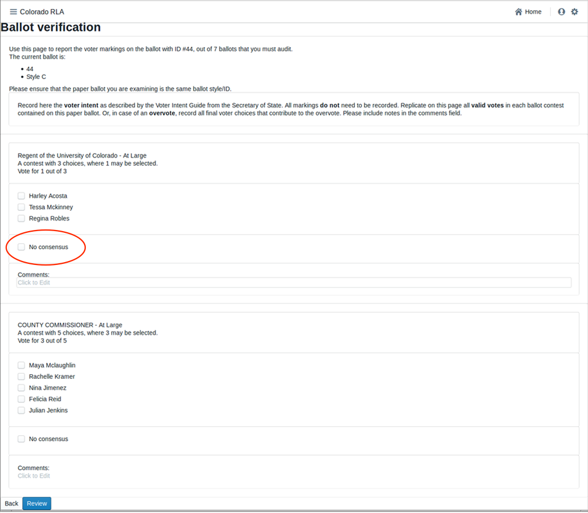
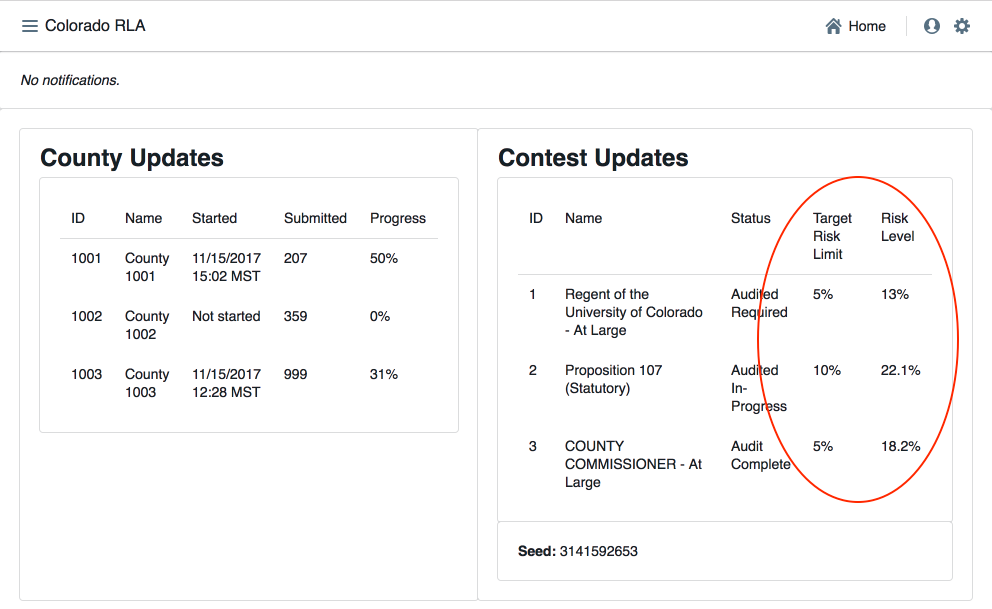
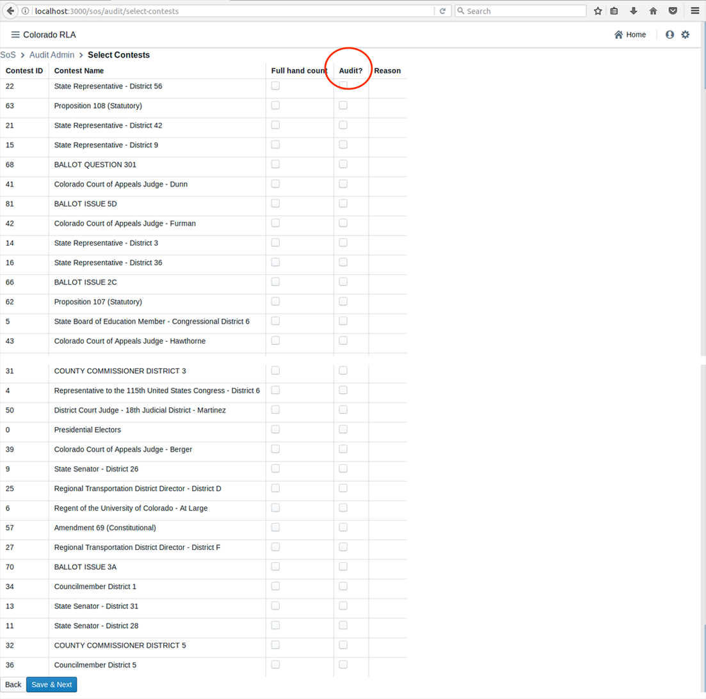

# Colorado Risk Limiting Audit 
# Run Book 

## Introduction

This Run Book is written for election administrators who will be 
implementing a Risk Limiting Audit (RLA) using the RLA Tool. 
The Run Book will assist these election administrators 
in using to tool to carry out the actions required
for a RLA.

### What the RLA Tool Does

The Risk-Limiting Audit tool, developed by Free & Fair 
for the Colorado Department of
State for use in elections from November 2017 forward, supports a 
Risk-Limiting Audit as required by Colorado statute and 
as described in the [Colorado Secretary of State's Rule 25](http://www.sos.state.co.us/pubs/rule_making/CurrentRules/8CCR1505-1/ElectionRules.pdf) for
elections. The RLA Tool supports a variety of 
requirements of Rule 25.2.2 and Rule 25.2.3, as described
in detail below.

The RLA Tool enables the Secretary of State and each individual 
County to carry out a Risk-Limiting Audit. The Secretary of State can
enter the risk limit, the random seed and the contests that drive
the audit process. The Secretary of State can also identify 
contests that should go to a full hand count. Counties can upload
ballot manifests and cast vote record (CVR) files. The
RLA tool performs the necessary calculations (such as 
choosing random samples of ballots for audit and determining 
actual risk levels). County Audit Boards can 
enter interpretations of ballots into the tool. And the Secretary of
State can monitor the progress of the individual Counties.

The RLA Tool also creates export files for use in the Audit
Center, a website disseminating audit-related information
to the public.
 
### What the RLA Tool Does Not Do

Although the rules governing the RLA requires Counties to 
generate and preserve a Summary Results Report and a Results File Export, the 
RLA Tool does not interact with these particular files in any way. 
Nor does the RLA Tool aid the CVR Export Verification required by the 
rules. These processes and files are not discussed in this Run Book.

While the RLA Tool does provide for upload of the 
hashed Ballot Manifest, the hashed CVR file and their hashes, 
the RLA Tool does not provide a hashing utility.

The current version of the RLA Tool does not provide any support
for chain of custody logs. Nor does it provide any rules 
or suggestions for interpretation of the marks on any particular ballot. 

Looking at Rule 25, the following required actions must be completed 
outside of the RLA Tool:
* 25.2.2 (B), (C), (D), (E)

Looking at Rule 25, the following required actions are performed automatically 
by the RLA Tool:
* 25.2.2 

### Logging In

### 25.2.2 (A), Entering the Risk Limit

The Sectretary of State will enter the Risk Limit for comparison audits.

### 25.2.2 (B) - (E)

These parts of Rule 25 must be completed outside of the RLA Tool.

### 25.2.2 (F) or (G), Audit Uploads

To prepare for upload the ballot manifest and the CVR file must be
first verified and hashed, using any SHA-256 hash utility. The RLA Tool 
itself does not provide a utility for verification or hashing.

Once the ballot manifest files have been hashed, the County user can 
upload them into the RLA Tool.

The upload of RLA Tabulation Results Export to the State's Election Night Reporting System required by 25.2.2 (F)(3) 
must be completed outside of the RLA Tool.

### 25.2.2 (H), Entering the Random Seed

The Secretary of State will enter the random seed.

The RLA Tool uses the random seed in the required pseudo-random number generator. The
RLA Tool also exports the random seed in a standard format,
which the Secretary of State can post to the Audit Center hosted on the 
Secretary of State website. 
<!-- comment: is this implemented? -->

### 25.2.2 (I) Selecting Contests

The Secretary of State will select the contests that will
drive the sample size and stop/go decisions for each round.
Note that while Rule 25 calls these "contests to be audited", 
the RLA Tool effectively audits all contests, while using the 
contests selected by the Secretary of State to calculate the risk levels.

### 25.2.2 (J) Number of Ballot Cards to Audit
The number of ballot cards to audit changes during the course of the audit depending
on the risk level, which in turn depends on the number of overstatements (i.e., ballots whose correction by the Audit Board
decreases a margin of victory in one of the selected contests) so far.

The current number of ballot cards to audit can be found.
<!-- to SoS? to County? to both? -->

### 25.2.2 (K) Random Selection of Ballot Cards for Audit

Based on the pseudo-random number generator
and random seed from 25.2.2 (H)
and the current risk levels,
the RLA Tool determines the selection of ballot cards for audit. 
The selection of ballots can be viewed. 
<!-- to SoS? to County? to both? -->

### 25.2.3 (A) Ballot Retrieval, Chain of Custody and Examination

Ballot retrieval from storage container and verification of 
seals relative to the chain-of-custody logs must be done 
outside the RLA Tool. 

#### 25.2.3 (A)(1) Comparison Auditsg

The RLA Tool provides a sign-in page for Audit Board members starting 
an audit or resuming after a break.

The RLA Tool allows Audit Boards to report the markings on each individual ballot.

After entering the interpretation of the markings from any one ballot, the 
Audit Board can review what was entered.

### 25.2.3 (A)(2) Ballot Polling Audits
The conduct and reporting of the Audit Board for a Ballot Polling Audit 
must be completed outside the RLA Tool.

### 25.2.3 (B) Non-Unanimous Audit Board
An Audit Board can use the RLA Tool to report lack of consensus on any particular contest on any particular ballot.

### 25.2.3 (C) Comparisons, Termination, Additional Ballots
The RLA Tool performs the comparison of the Audit Board's interpretations with the corresponding 
cast vote record from the voting computer system. The results of this comparison 
are exported for the Secretary of State to post on the Audit  (outside the RLA Tool).
The RLA Tool will allow the Secretary of State to see if the required Risk Limit has 
been met for the selected contests.

The RLA Tool also allows the Secretary of State to designate a contest for hand counting.

The RLA Tool automatically randomly selects additional ballots for audit as necessary.

### Logging In

Screenshot (County Admin Authentication) ---

***ballot manifest upload prep

Once the ballot manifest and CVR files are verified and hashed, 
they can be uploaded. If the upload process is interrupted the
process will have to be repeated, it will not resume uploads.

Screenshot (page:county) ---

Note that the RLA Tool does not support export of the
tabulation results to the Election Night Reporting System. 

### 25.2.2 (G), Ballot Polling Audit Upload

The current version RLA Tool is designed for comparison audits, which require a voting
system capable of exporting CVR files. However, Counties whose voting systems do not
export CVR files can use the RLA Tool to upload ballot manifests, described
in the [Comparison Audit Upload](#comparison-audit-upload) 
section.

### List of Ballot for Audit

To see the list of ballots to be audited in the next round.

Screenshot (???) ---

## For County Audit Boards

========

### Signing In

The Audit Board does not log directly into the RLA Tool with
computer system usernames and passwords. However, whenever 
the Audit Board begins to interact with the RLA Tool, either 
at the beginning of an audit round or after taking a break, 
there is an informal sign-in process. After the authenticated County Audit 
Administrator formally logs in, there is a screen where the identity and 
party affiliation of Audit Board Members can be entered or changed.

Screenshot (page:Acme County) ---

Click on "Start Audit"

Screenshot (page:Audit Board Sign In) ---

Click "Next"

### Auditing Ballots

Note: do *not* use your browser's "back" arrow during the audit process.

Screenshot (Ballot Verification) ---

Before recording voter intent, please double-check that the paper ballot
ID and Ballot Style match the ID and ballot style listed on the screen.
Then record on the screen all final voter intent marked on the paper ballot.
In case of an overvote, mark each of the (too many) choices the voter 
intended; the RLA tool will recognize the overvote. In case the Audit 
Board cannot reach consensus, mark the "No Consensus" box on the screen.
Audit Board members can make notes in the comment field.
***Review CDOS

Click "Review"

Screenshot (Review Screen) ---

Check that the information on the review screen reflects the 
Audit Board's interpretation of the ballot. Note that in case of 
an overvote, the review screen will say, simply, "overvote".

Note: do *not* use your browser's "back" arrow during the audit process.
If the review screen does not match the Audit Board's interpretation,
click the "Back" button.

If the review screen matches the Audit Board's interpretation,
click "Submit and Next Ballot". This submission is final. There 
is no way to revise a ballot interpretation once it has been submitted
from the Review Screen.

This process continues until the audit is complete, or a Full Hand Count
has been called by the CDOS.
