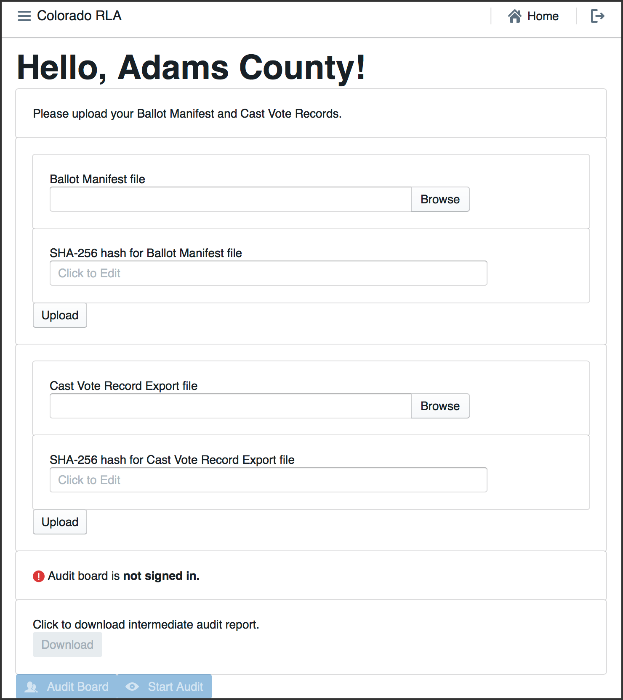
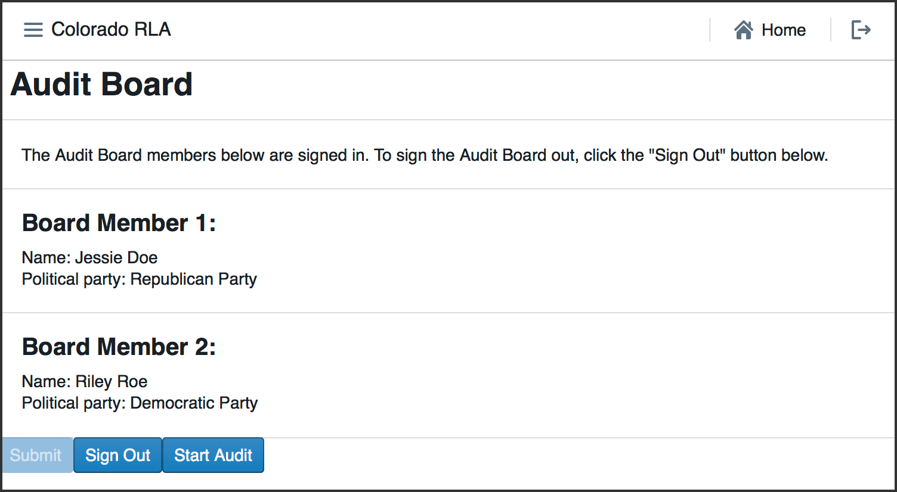
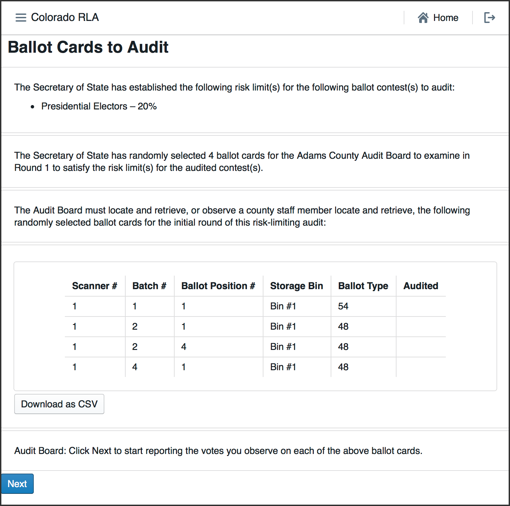
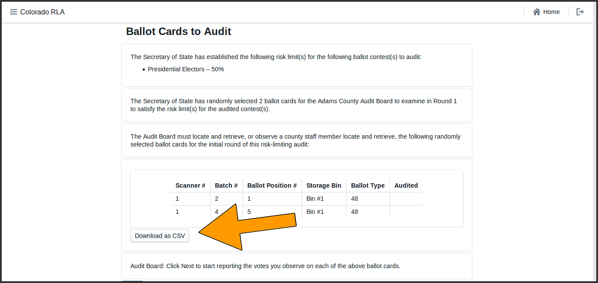
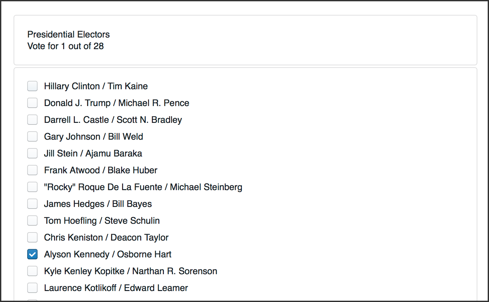
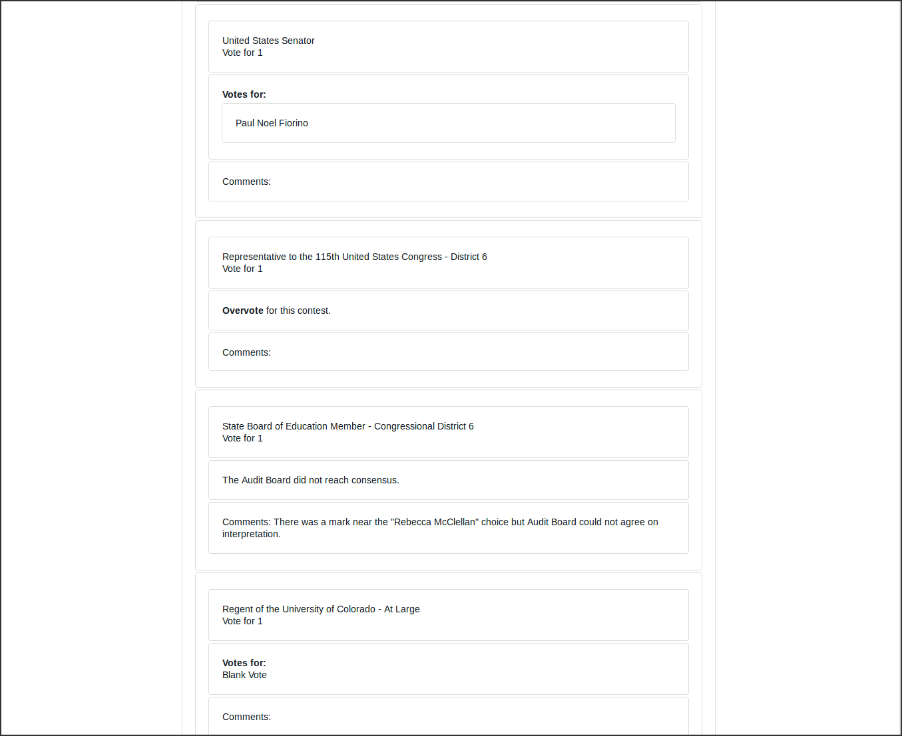
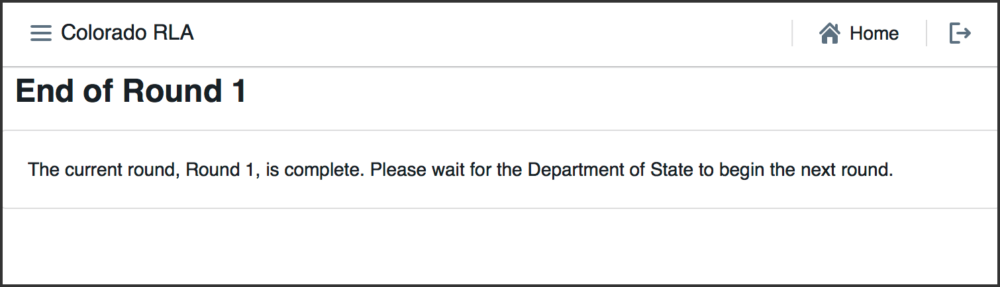
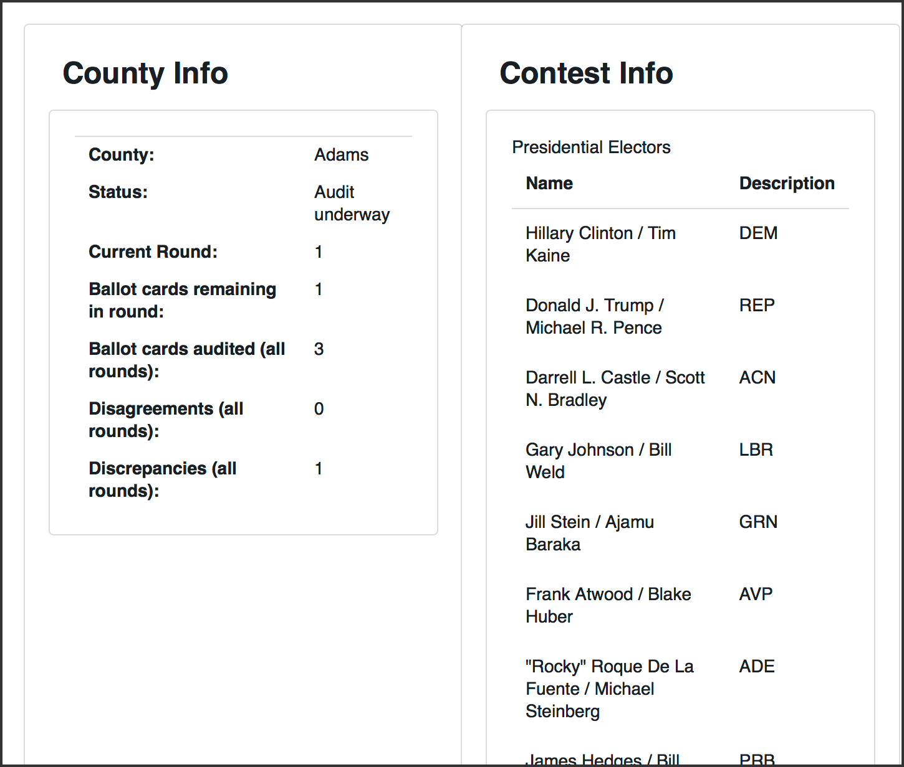

% User Manual
% Colorado Risk Limiting Audit Tool v1.0.0 alpha-2
% 2017

# Introduction

This User Manual provides an overview of the components that comprise
the Colorado Department of State (CDOS) Risk Limiting Audit Tool
(RLA Tool). It contains screenshots of every page users experience. It
also contains a glossary of relevant terms. This RLA Tool represents
the cutting edge in efforts to provide verifiable evidence that
election results are accurate, and November 2017 is the first time any
state has implemented them on a wide scale basis.

## Overview of Risk Limiting Audits with the RLA Tool

The RLA Tool is a computer system, installed on 
computer 
infrastructure 
managed by the Department of State. The system provides a 
web interface, accessible in a web browser
via a url determined by the Department 
of State. Recommended browsers include Firefox, Chrome and Safari.

Once the Secretary of State uses the RLA Tool to establish a risk
limit and designate contests to guide the audit, counties use the RLA
Tool to upload verified ballot manifests and cast vote records (CVRs)
files that they have exported from their Election Management
Systems. The RLA Tool uses this data to determine the random ballot
cards to audit, using the risk limit and the margins of victory in the
selected contests as a guide for what constitutes a quality audit. 

The RLA Tool reports this information to each county via County
Dashboard. Within the County, an Audit Board, consisting of
representatives of different political parties, working with county
administrators, physically retrieves the randomly chosen ballot cards
and record their interpretations of voter intent in the RLA Tool.
Randomly selected ballot cards are presented to County Audit Boards until
either the risk limit is satisfied or the Secretary of State indicates
that a full hand count is required.

Complete audit results and artifacts allowing the public to check,
independently, that the audit was carried out correctly are exported
from the RLA Tool for import to a Public Audit Center hosted on the
official CDOS website.

## Limitations of the Current Version
In the current version
of the RLA Tool, all contests are considered to be single-county contests.
For example, in the context of the audit, the contest for votes for US Senator in Boulder County 
has nothing to do with the contest for US Senator in Pueblo County 
(even though in the real world the winner of the US Senate race is determined by combining vote totals from all Counties).

\newpage
# Basic Functions

## Launching and Logging In

To launch the RLA Tool, point a web browser to the
URL provided by the Colorado Department of State.
On this page authorized users can enter their login
credentials to access the RLA Tool Dashboards.

Successful entry of username and password will lead to 
a two-factor authentication grid challenge.

After two-factor authentication,  users associated with the Department of State will see the
Department of State home page. 

Authenticated users associated with a County see a home page tailored to that County.

---

\newpage
## Navigation
In the upper left corner of every page the site has a navigation icon. Click on the
navigation icon to bring up the navigation menu.

In the upper right corner of each page is a button to return to 
the Home Page 

and a button to log out of the system 
altogether.

---

\newpage

# Setting Up the Audit

## State Definition of Audit 

To define the audit -- to specify the risk limit and other choices --
a State user 
navigates  to the Define Audit section. 
On this page, the user can enter the date of the election, the type of election, 
the date of the public meeting to choose the random seed and the risk limit.

These choices are summarized on the next page.

\newpage
## County File Uploads

On the County Home page County officials upload their hashed verified Ballot
Manifest and CVR files. The purpose of the hashing is to detect transmission 
errors. The files travel over the internet from the County Board of Election 
to the Department of State. Before sending a file, the County must enter into the RLA Tool interface a string of numbers
and letters (called a "hash") calculated on the file via the Secure Hash Algorithm 256 ("SHA-256" designed by the
National Security Agency and freely available to the public).
When a file arrives at the Department of State's computer, the RLA Tool calculates the 
SHA-256 hash of the file. If the file has been changed during transmission,
the hash calculated by the Department of State will not match the hash entered by the 
County, the error will be detected by the system and the County will re-upload the file.

This version of the RLA Tool recognizes and accepts files exported from the Dominion Democracy Suite. The Dominion cast vote record export must be redacted to remove the CountingGroup column.

\newpage
## Selection of Contests
The Secretary of State will then select the contests that will drive
the sample size and stop/go decisions for each round.  Rule 25
calls these "contests to be audited". 

## Random Seed

After all Counties have uploaded the required files, the Department of State holds a public meeting to determine
the random seed for the selection of ballot cards to audit. 
Once a State user enters the random seed into the RLA Tool, 
which determines the random sequence of ballot cards (with replacement) using 
the Pseudo-Random Number Generator using SHA-256 cited in Rule 25. 

\newpage
## Audit Definition Review

This page allows the Secretary of State to review the audit data which will
be used to define the list of ballot cards to audit for each county.

\newpage
# Auditing

## Audit Rounds

The audit is organized into rounds. The first round begins
when the Secretary of State launches the audit. 
The RLA Tool gives lists each County a list of ballot cards to be 
reviewed by the County Audit Board. As the Audit Boards 
proceed, the Secretary of State can monitor progress. 

When each County Audit Board has reviewed all assigned ballot cards and
certified its review, the Secretary of State will have the option to begin the next round.

Once the audit is launched, the first round of the audit begins. In
each round, the tool shows each County a list of ballot cards to be
reviewed. As the County Audit Boards review ballot cards and enter
interpretations, the Secretary of State can see the number of ballot
cards reviewed so far, the number of ballot cards with discrepancies
(between audit board interpretations and the CVR file), the number of
ballot cards on which the audit board disagreed, and the number of
ballot cards yet to be reviewed in the current round in the County
Update table.

At the end of each round, if the 
Risk Limit has not been met yet, the Secretary of State can launch the next
round.

## County Audit Board Activity

The Audit Board does not log directly into the RLA Tool with usernames
and passwords. However, whenever the Audit Board begins to interact
with the RLA Tool, either at the beginning of an audit round or after
taking a break, there is an informal sign-in process.
Note that all audit board
members must input first and last names as well as party affiliation.
If an audit board member has only a single name, include it as they
normally would on any digital input form and put "N/A" in the unused
field.

After the Audit Board has signed in, the Audit Board Screen
will show the names and party affiliations. 

After the Audit Board has signed in, they can use the RLA Tool to review ballot cards.
If there is a round in progress for the County,
the
user will see a list of ballot cards to be audited in the current
round. The list includes the Scanner, Batch, and Ballot Position
numbers, and (if available) the Storage Bin. As the round progresses the rightmost 
column will contain check marks for ballot cards that have been reviewed. 

This page has  a button to download a csv file that can be saved or printed, containing 
the list of ballot cards.

Once the ballot cards have been retrieved,  Audit Board members can report the markings on each
individual ballot card.  .

After entering the interpretation of the markings from any one ballot
card, the Audit Board uses the
Review screen to check that the information shown
reflects the Audit Board's interpretation of the contests on the ballot card. After 
the review, the Audit Board submits this interpretation
and the RLA Tool presents contests from the next ballot card.

After the last
ballot card has been reviewed,  the Audit Board is asked to certify the round.

After certification, until a new round starts, the end of round page appears.

## Monitoring the Audit in Progress

While the audit is in progress, both the State and the Counties can see overviews of the status.  

### Monitoring on the State Site ###
On the State home page, in addition to the risk limit and the random seed  
there is a brief statement of the status of the round. 

	 
The State home page also has a detailed County Update table and a list of the contests that 
have been chosen to drive the audit.

The County Update Table has several columns.

	 *  Status - The Status of the County's audit 
	 *  Submitted - The number of ballot cards already reviewed by the Audit Board
	 *  Audited Contest Discrepancies - the number of cast vote records whose corresponding ballot card either could not be found, or contains at least one race selected for audit for which the Audit Board's interpretation differs from the cast vote record
	 *  Non-audited Contest Discrepancies - the number of cast vote records whose corresponding ballot card either could not be found, or contains at least one race not selected for audit for which the Audit Board's interpretation differs from the cast vote record 
	*  Disagreements - the number of ballot cards on which the Audit Board could not come to consensus in at least one race
	*  Remaining in Round - the number of ballot cards remaining for the Audit Board to review in order to complete the current round
	*  Est. Remaining Ballots - the estimated size of the statistical random sequence of cast vote records that will be required to finish the audit (with duplicates) minus the size of the longest prefix of that sequence consisting of cast vote records whose corresponding ballot cards have already been reviewed by the Audit Board.

### Monitoring on the County Site ###

While the audit is on-going, the County Info table shows how many ballot cards
are required for the current round, and how many have already been
audited. The number of "disagreements" is the number of ballot cards
on which the Audit Board could not come to complete consensus. The
number of "discrepancies" is the number of ballot cards where the
Audit Board's interpretation differs from the interpretation in the
uploaded CVR file, or where the ballot card in question could not be
found.

<!-- ## Hand Counts 
-->

# Exports and Reports
From the County Home page, depending on the status of the audit, a County can download an intermediate or final audit report.

<!-- ## State audit reports and exports 
-->

