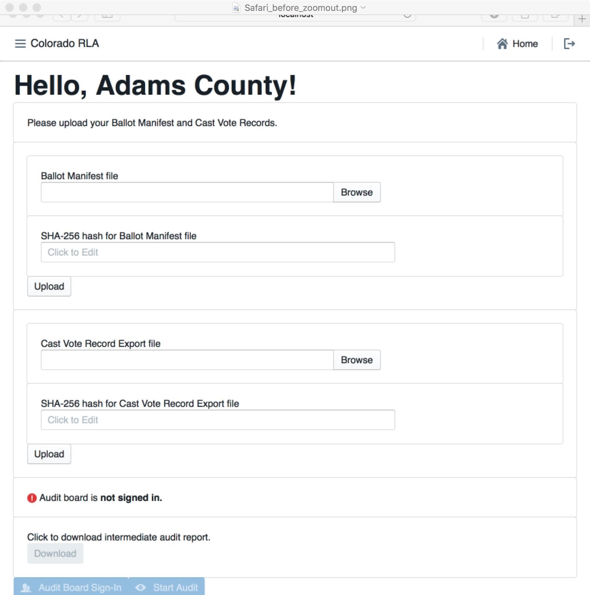
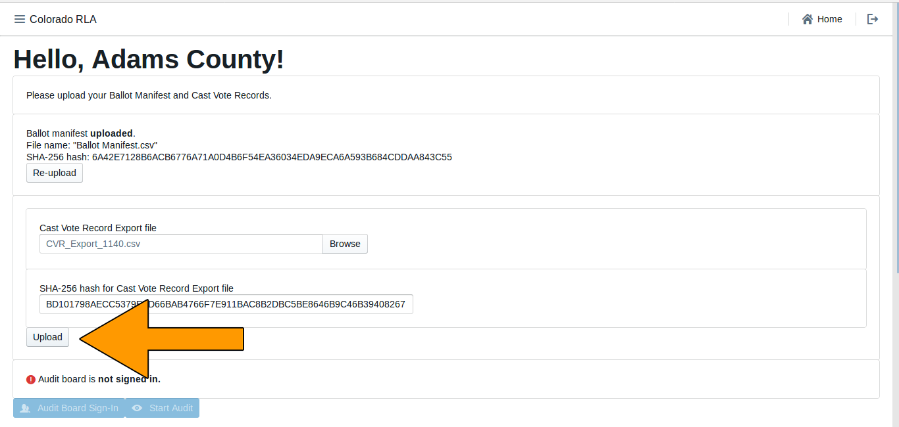
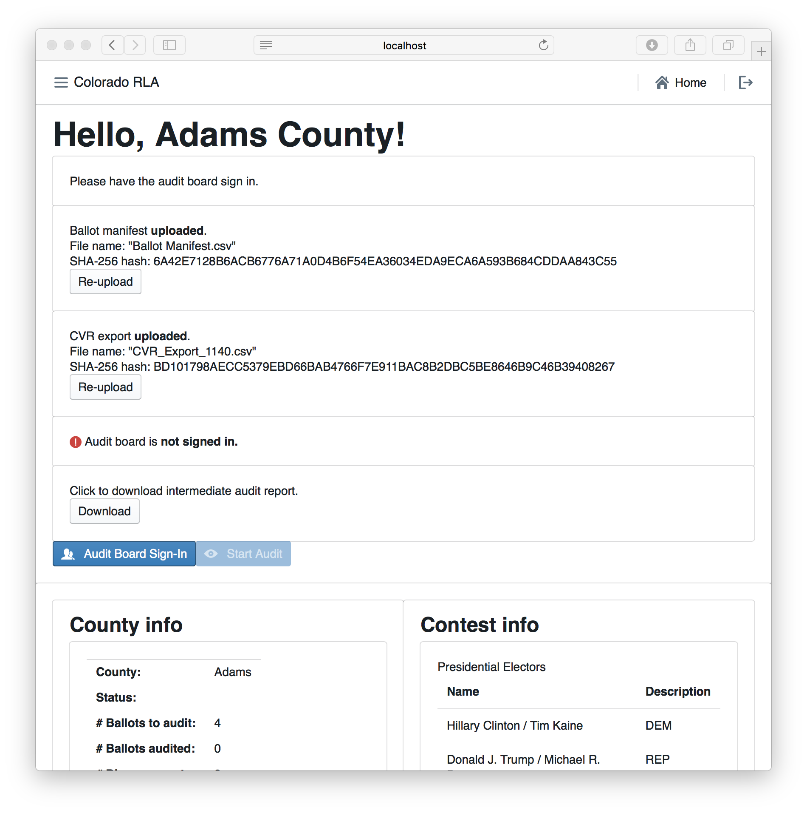
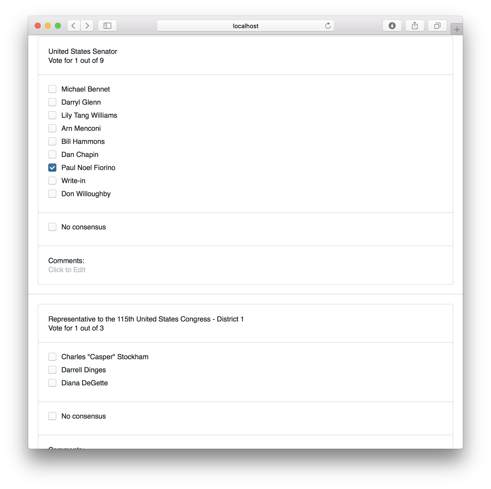
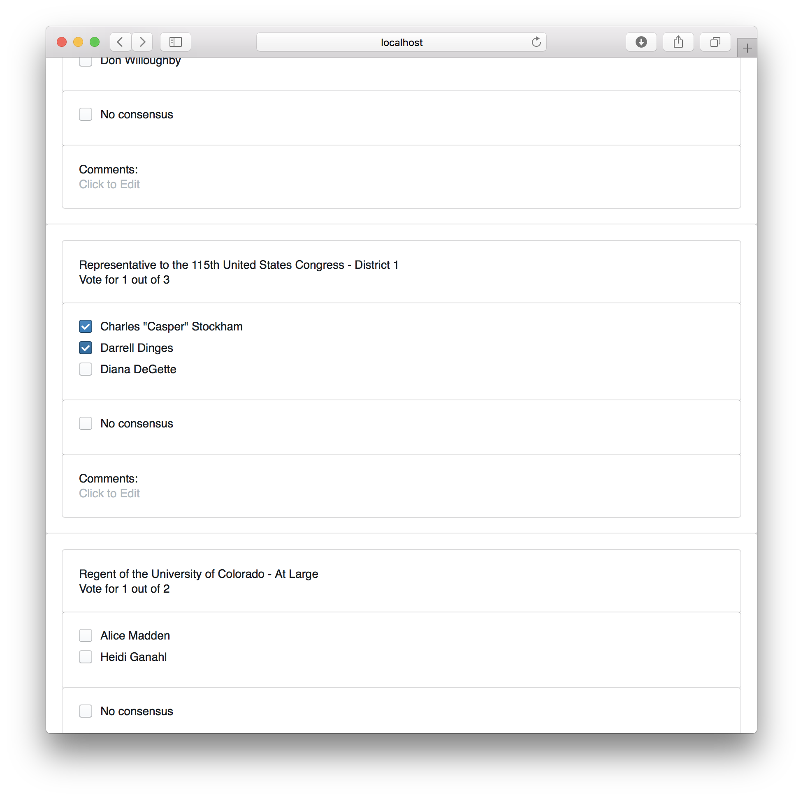
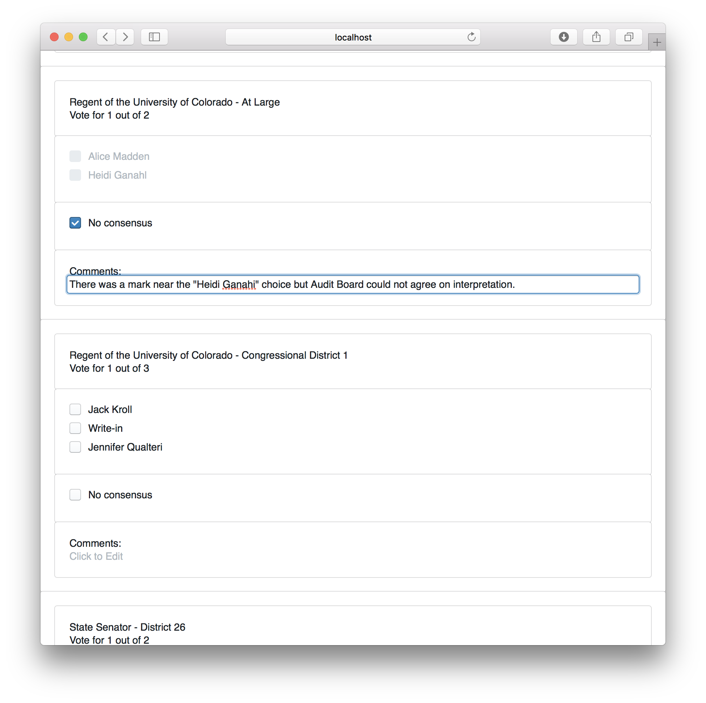
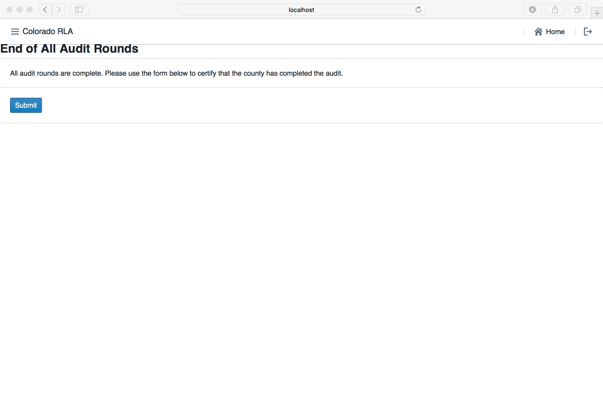

# Colorado Risk Limiting Audit 
# County Run Book

## Introduction

This Run Book guides County election administrators in Colorado who
will be implementing a Risk Limiting Audit (RLA) with a comparison
audit.  The RLA Tool, developed by Free & Fair for the Colorado
Department of State for use in elections in November 2017 and later,
supports running a Risk-Limiting Audit as required by Colorado statute
and as described in
the
[Colorado Secretary of State's Rule 25](http://www.sos.state.co.us/pubs/rule_making/CurrentRules/8CCR1505-1/ElectionRules.pdf) for
elections.

The RLA Tool helps each County fulfill the requirements of Rule 25.2.2
and Rule 25.2.3.  First the County uploads verified ballot manifests
and cast vote record (CVR) files. For each round of the RLA, the RLA
Tool tells the County which ballot cards to audit, allows the County
to enter Audit Boards interpretations of the ballot cards and allows
the Audit Board to sign off on the round.

Orange arrows on the screenshots indicate features described in the
text of the Runbook.
 
### Launching and Logging In

A County user can launch the RLA Tool by pointing a browser to the
URL provided by the Colorado Department of State.

Successful entry of username and password will lead to 
a two-factor authentication grid challenge.

***

County users will see the County home page. Note the logout
button , in the upper
right of this (and every) page.

### Navigation

In the upper left corner of every page 
the County site has a menu that 
can be used to navigate to the County home page,
the Audit Board Sign-In/Out pages or the 
Audit (Ballot Review) pages.

In the upper right corner of each page is a button to return to 
the County home page 

and a button to log out of the system 
altogether.

### Ballot Manifest and CVR File Uploads

To prepare for upload, the County's ballot manifest and CVR files must
 each be hashed using any SHA-256 hash utility. The RLA Tool itself
 does not provide a utility for verification or hashing.

Once the ballot manifest and CVR files are hashed, they can be
uploaded into the RLA Tool. If the upload is interrupted the process
will have to be repeated. It is not possible to resume an interrupted
upload — just start that file upload again.  If a County uploads
multiple Ballot Manifest files, only the data from the last file will
be used. Similarly, if a County uploads multiple CVR files, only the
data from the last file will be used.

***

If the hash does not match the file (either because the wrong hash was
entered, or because the file was changed as it traveled over the
network), the data from the file will be uploaded but the data will
not be imported. The user will see the following messages.

If the hash matches the file but the file is not in the proper format,
the data from the file will not be imported. The user will see the
following messages.

If the hash matches and the file format is correct, the system will
import the data from the file. The user will see the following
messages.

The time required for data import depends on the size of the
file. Import time for the CVR file will depend on the number of ballot
cards represented in the file. A file with fewer than 10,000 CVR lines
should take less than a minute, while a file with 500,000 CVR lines or
more might take about a half hour. The ballot manifest file upload and
import will be quicker than the CVR file upload and import.

Once both the ballot manifest and CVR files are successfully uploaded
and imported users will see them both listed as **uploaded**. It is
possible to re-upload either or both files, if necessary.

After successfully upload and import of both the Ballot Manifest and
the CVR files, the Contest Info table near the bottom of the 
County home page shows the status of ballot cards
and all contests on all CVRs.

### Audit Board Sign In and Sign Out

The Audit Board does not log directly into the RLA Tool with usernames
and passwords. However, whenever the Audit Board begins to interact
with the RLA Tool, either at the beginning of an audit round or after
taking a break, there is an informal sign-in process.

To allow the Audit Board to sign in, use the button on the County
home page.

Another way to reach the Audit Board Sign-In page is to use the navigation menu.

Either method will take the user to the Audit Board Sign-In page.

After the Audit Board has signed in, the Audit Board Sign-In Screen 
will show the names and party affiliations. If the Audit Board takes a break, 
use the Sign Out button on this page.

Once the Audit Board is signed in use the navigation panel at the top
of the screen to begin the ballot review process.

### Ballot Card Review Rounds

Once the Secretary of State launches the audit the County user will
see a list of ballot cards to be audited in the current round. The list
includes the Scanner #, Batch #, Ballot Position #, and (if available)
the Storage Bin.

Once the ballot cards have been retrieved, click "Next" to start reviewing.

The RLA Tool allows Audit Board members to report the markings on each
individual ballot card.  Before recording voter intent, please double-check
that the paper Ballot Type matches the Ballot Type listed on the
screen.

If a ballot card is not found click the "Ballot Card Not Found" Button.

Otherwise record on the screen all final voter intent marked on
the paper ballot card. 

In case of an overvote, mark each of the (too many) choices the voter
intended; the RLA tool will recognize overvotes and undervotes.  

If
the Audit Board cannot reach consensus, mark the "No Consensus"
box on the screen. There is a text box for any comments.

After entering the interpretation of the markings from any one ballot,
the Audit Board can click the Review button.

On the Review screen, check that the information shown
reflects the Audit Board's interpretation of the ballot. 

Note that in
case of an overvote, the review screen will say "Overvote for this
contest".

If the review screen does not match the Audit Board's interpretation,
click the "Back" button.  If the information on the review screen is
correct, click "Submit & Next Ballot".  

This submission is
final. There is no way to revise a ballot interpretation once it has
been submitted from the Review Screen.

The screen for the next ballot card will then be displayed. The process continues until
the Audit Board has reviewed all the ballot cards assigned to that 
County for that round. After the last ballot card has been reviewed,  the end-of-round page
will appear.
with boxes for the Audit Board to "sign" their approval of the round
by entering their names as indicated.

Clicking the "Submit" button on this page ends the County's work for the 
audit round. The Audit Board will still be signed in to the RLA Tool. If the Audit Board
wishes to sign out (say, for a coffee break) then 
they may use the main menu to navigate to the "Audit Board Sign-In" page 
and click the "Sign Out" button.

### County Home Page During Audit

Note that while the audit is in progress, the County Home page gives a
summary of progress. The County Info table shows how many Ballot Cards
are required for the current round, and how many have already been
audited. The number of "disagreements" is the number of ballot cards
on which the Audit Board could not come to complete consensus. The
number of "discrepancies" is the number of ballot cards where the
Audit Board's interpretation differs from the interpretation in the
uploaded CVR file, or where the ballot card in question could not be
found.

### Audit Board Intermediate Audit Report Page

If the Audit Board needs to take a break, go to lunch, head home for
the night, or pause their work for any reason, then the Audit Board
must file an "Intermediate Audit Report" on their auditing. They
should use the Sign Out button on the Audit Board Sign-in
Page. *(Ed. note: Intermediate Audit Reports are not included in this
release.)*

### Audit Board Final Audit Report Page

When the County has completed the entire audit, the County will be
able to download a final audit report by clicking the button on the
End of Audit page.

