% County Run Book
% Colorado Risk Limiting Audit Tool v1.0.0 alpha-2
% 2017

# Introduction

This Run Book guides County election administrators 
who
will be implementing a Risk Limiting Audit (RLA) with a comparison
audit.  The RLA Tool, developed by Free & Fair for the Colorado
Department of State for use in elections in November 2017 and later,
supports running a Risk-Limiting Audit as required by Colorado statute
and as specified in
the
[Colorado Secretary of State's Rule 25](http://www.sos.state.co.us/pubs/rule_making/CurrentRules/8CCR1505-1/ElectionRules.pdf) for
elections.

Orange arrows on the screenshots indicate features described in the
text of the Run Book.

 
# County Admin Functions
## Launching and Logging In

A County user can launch the RLA Tool by pointing a browser to the
URL provided by the Colorado Department of State.

Successful entry of username and password will lead to 
a two-factor authentication grid challenge.

## Navigation

Once two-factor authentication is complete, County users will see the County Home Page
and can enter the information to set up the audit.

In the upper left corner of every page the County site has a menu that
can be used to navigate to the County Home Page, the Audit Board
Sign-In/Out pages or the Audit (Ballot Review) pages. Click on the
navigation icon to bring up the navigation menu.

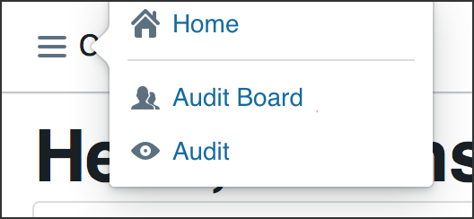

In the upper right corner of each page is a button to return to 
the County Home Page 

and a button to log out of the system 
altogether.

## Ballot Manifest and CVR File Uploads

To prepare for upload, the County's ballot manifest and CVR files must
each be hashed using any SHA-256 hash utility. The RLA Tool itself
does not provide a utility for hashing, but uploaded files are
verified against the provided hash.

Once the ballot manifest and CVR files are hashed, they can be
uploaded into the RLA Tool. If the upload is interrupted, the process
will have to be repeated. It is not possible to resume an interrupted
upload—just start that file upload again.  If a County uploads
multiple Ballot Manifest files, only the data from the last file will
be used. Similarly, if a County uploads multiple CVR files, only the
data from the last file will be used. To upload the ballot manifest:

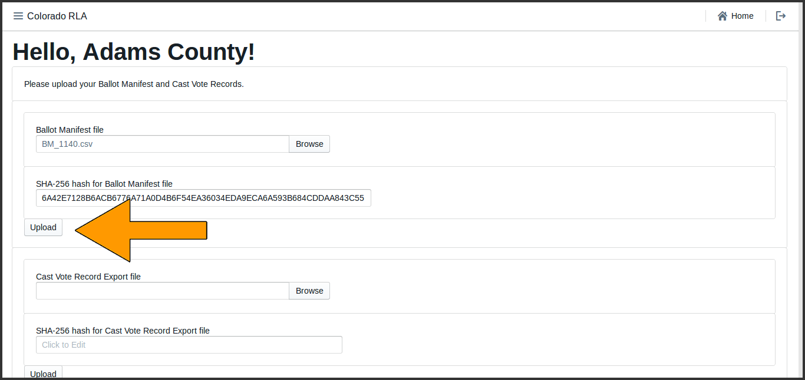

***

If the hash does not match the file (either because the wrong hash was
entered, or because the file was changed as it traveled over the
network), the data from the file will be uploaded but the data will
not be imported. The user will see the following messages.

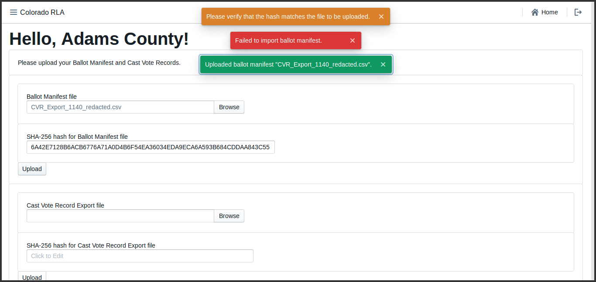

**Remedies and Mitigations**

In this situation, please double-check that you have: (a) chosen and
uploaded the correct file, (b) hashed the correct file, (c) use the
correct kind of hash (it must be SHA-256), and (d) copied the entire
hash code into the appropriate text box.

If the hash matches the file but the file is not in the proper format,
the data from the file will not be imported. The user will see the
following messages.

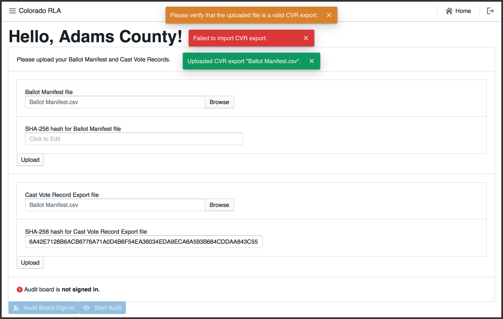

If the hash matches and the file format is correct, the system will
import the data from the file. The user will see the following
messages.

**Remedies and Mitigations**

In this situation, please double-check that you have: (a) chosen and
uploaded the correct file, (b) removed the "CountingGroup" column 
from the CVR file, (c) not edited or tampered with the file in
any other fashion, and (d) are uploading a CSV file, not a JSON file.

The time required for data import depends on the size of the
file. Import time for the CVR file will depend on the number of ballot
cards represented in the file. A file with fewer than 10,000 CVR lines
should take less than a minute, while a file with 500,000 CVR lines or
more might take about a half hour. The ballot manifest file upload and
import will be quicker than the CVR file upload and import.

Once both the ballot manifest and CVR files are successfully uploaded
and imported users will see them both listed as **uploaded**. It is
possible to re-upload either or both files, if necessary.

After successfully upload and import of both the Ballot Manifest and
the CVR files, the Contest Info table near the bottom of the County
Home Page lists all contests from the CVR file. The user may have to
scroll down to see all contests.

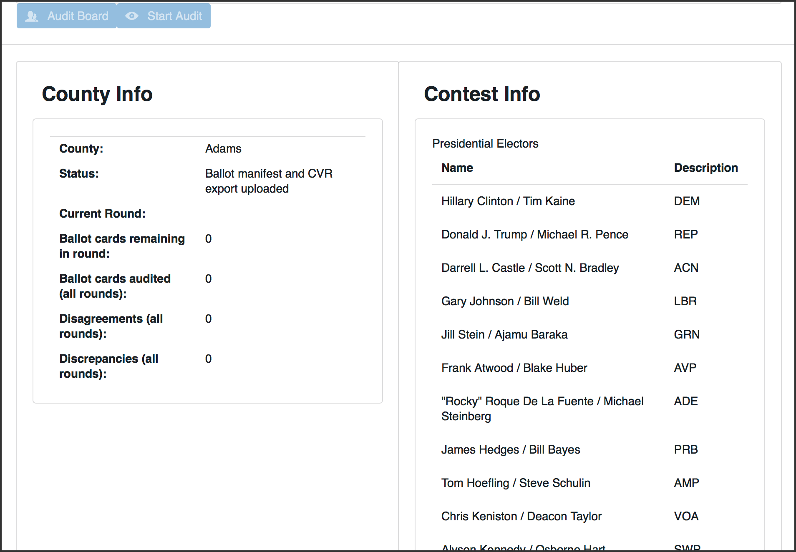

At this stage in the audit process the County must wait for the
Department of State to choose which contests to audit and what the
risk limits will be on those contests.  Once the Department of State
has started the audit, the County may continue to the next step of the
audit process.

## Monitoring the Audit

While the audit is on-going, the County Info table shows how many Ballot Cards
are required for the current round, and how many have already been
audited. The number of "disagreements" is the number of ballot cards
on which the Audit Board could not come to complete consensus. The
number of "discrepancies" is the number of ballot cards where the
Audit Board's interpretation differs from the interpretation in the
uploaded CVR file, or where the ballot card in question could not be
found.

# Audit Board Functions

To sign the Audit Board in or out, click the "Audit Board" button on the County
home page.

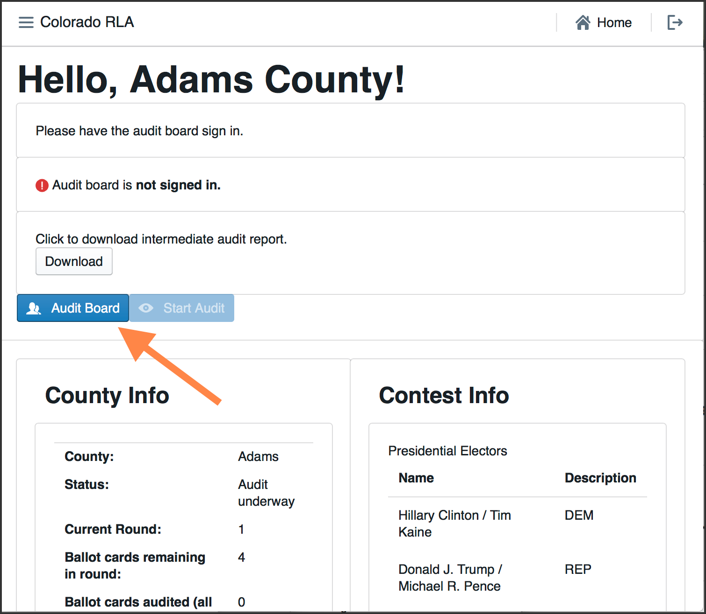

Another way is to use the navigation menu.

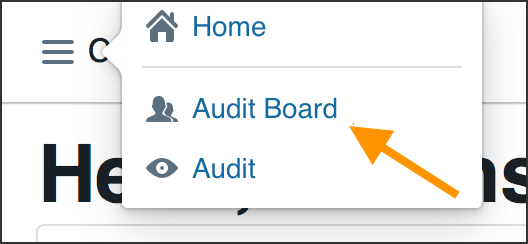

Either method will take the user to the Audit Board page.

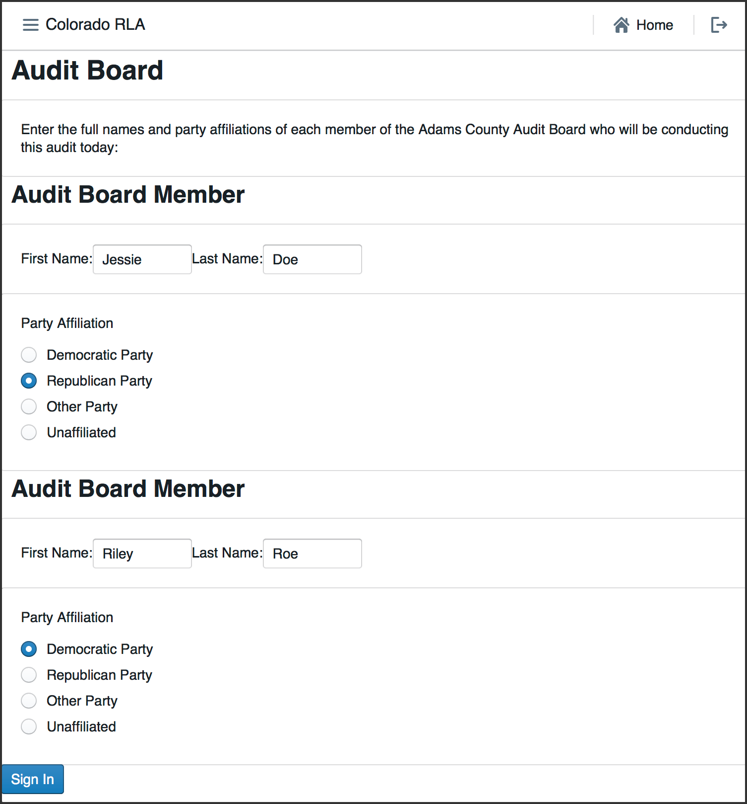

## Audit Board Sign In

The Audit Board does not log directly into the RLA Tool with usernames
and passwords. However, whenever the Audit Board begins to interact
with the RLA Tool, either at the beginning of an audit round or after
taking a break, there is an informal sign-in process.
Note that all audit board
members must input first and last names as well as party affiliation.
If an audit board member has only a single name, include it as they
normally would on any digital input form and put "N/A" in the unused
field.

After the Audit Board has signed in, the Audit Board Screen
will show the names and party affiliations. 

## Ballot Card Retrieval

After the Audit Board has signed in, they can start the audit process.
Use the 
"Start Audit" button on the Audit Board screen. Or
use the navigation menu at the top left. 

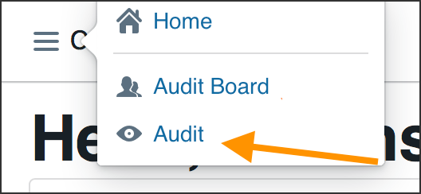

There is a welcome screen for the audit. Click "Next" to proceed.

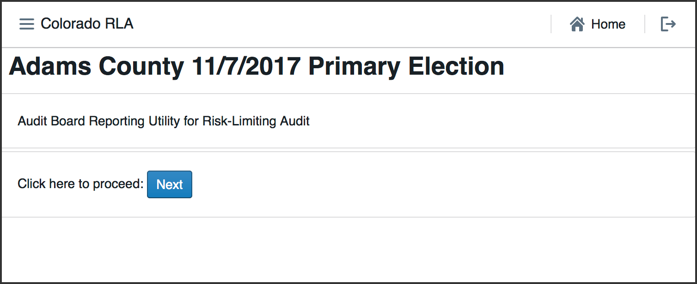

If the Secretary of State has launched a round of the audit the County
user will see a list of ballot cards to be audited in the current
round. The list includes the Scanner, Batch, and Ballot Position
numbers, and (if available) the Storage Bin. As the round progresses the rightmost 
column will contain check marks for ballots that have been reviewed. 

This page has  a button to download a csv file that can be saved or printed, containing 
the list of ballots.

## Ballot Card Review

Once the ballot cards have been retrieved, click the "Next" button to
start reviewing.

The RLA Tool allows Audit Board members to report the markings on each
individual ballot card.  Before recording voter intent, please
double-check that the Ballot Type on the paper ballot card matches the
Ballot Type listed on the screen.

If a ballot card is not found click the "Ballot Card Not Found" button.

Otherwise record on the screen all final voter intent marked on
the paper ballot card. 

The list of candidates includes qualified write-in candidates.

In case of an overvote, mark each of the (too many) choices the voter
intended; as the user will see on the next screen, the RLA Tool will recognize
the overvote.  

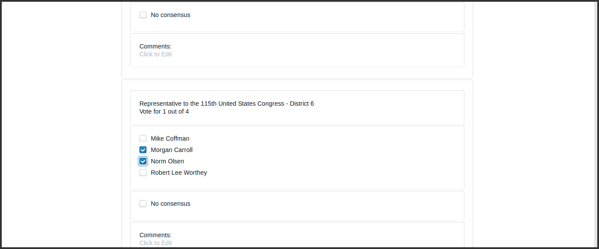

If the Audit Board cannot reach consensus, mark the "No Consensus" box
on the screen. There is a text box for any comments the audit board
might wish to add in this circumstance.

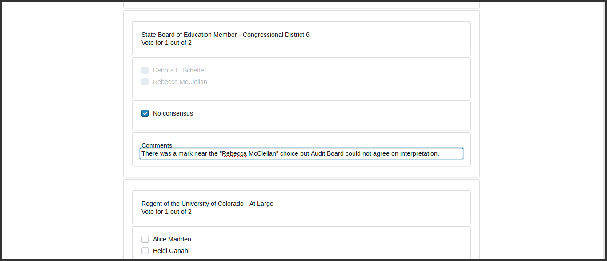

After entering the interpretation of the markings from any one ballot
card, the Audit Board clicks the "Review" button.

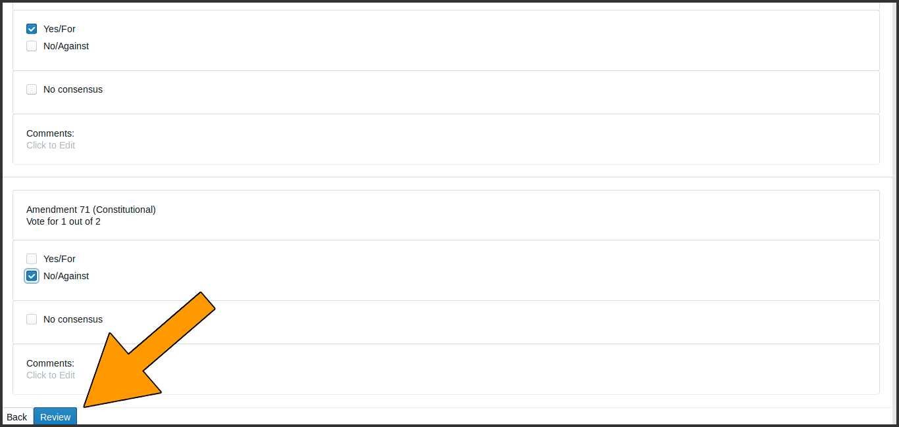

On the Review screen, check that the information shown
reflects the Audit Board's interpretation of the ballot. 

Note that in
case of an overvote, the review screen will say "Overvote for this
contest".

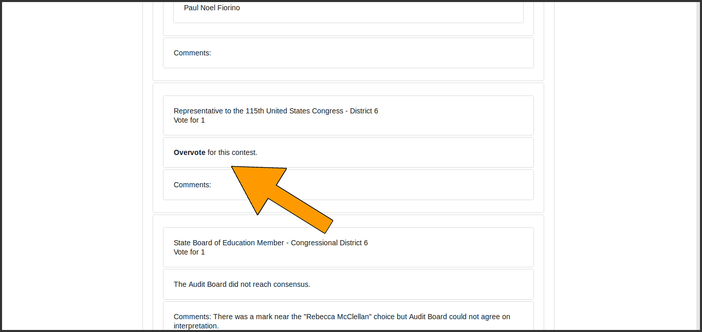

If the review screen does not match the Audit Board's interpretation,
click the "Back" button and correct the interpretation.  If the
information on the review screen is correct, click "Submit & Next
Ballot".

This submission is
final. There is no way to revise a ballot interpretation once it has
been submitted from the Review Screen.

The screen for the next ballot card will then be displayed. Review of
ballot cards will continue until the Audit Board has reviewed all the
ballot cards assigned to that County for that round. 

## End of Round

After the last
ballot card has been reviewed, the end-of-round page will appear.
with boxes for the Audit Board to certify the round
by entering their names as indicated. The order of the names
does not matter. Clicking the "Submit" button on this page ends the County's work for the 
audit round. 

After certification, until a new round starts, the end of round page appears.

## Signing out the Audit Board for Breaks

If the Audit Board needs to take a break, go to lunch, head home for
the night, or pause their work for any reason, then the Audit Board
must use the Sign Out button on the Audit Board Page.

Whenever the Audit Board is signed out, the Audit Board page will display 
the sign-in form. 

# Ending the Audit

When the County has completed the entire audit, including all rounds
of ballot card review required by the State, the County Home Page
will appear. The page will state that "the audit is complete".

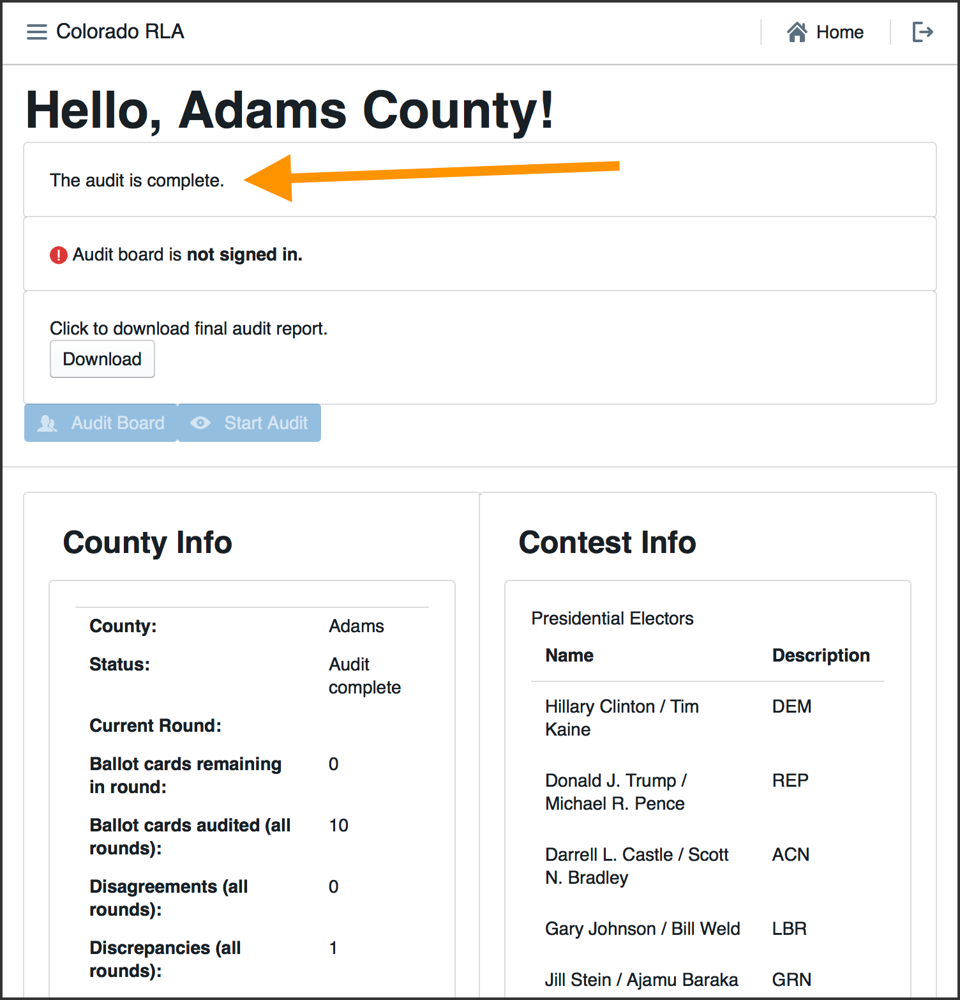

# Audit Reports

The "Download" button on the County Home page will download an Intermediate Audit Report if 
the audit is still in progress and a Final Audit Report if the audit is complete.

<!-- ## Hand Counts ##
-->

