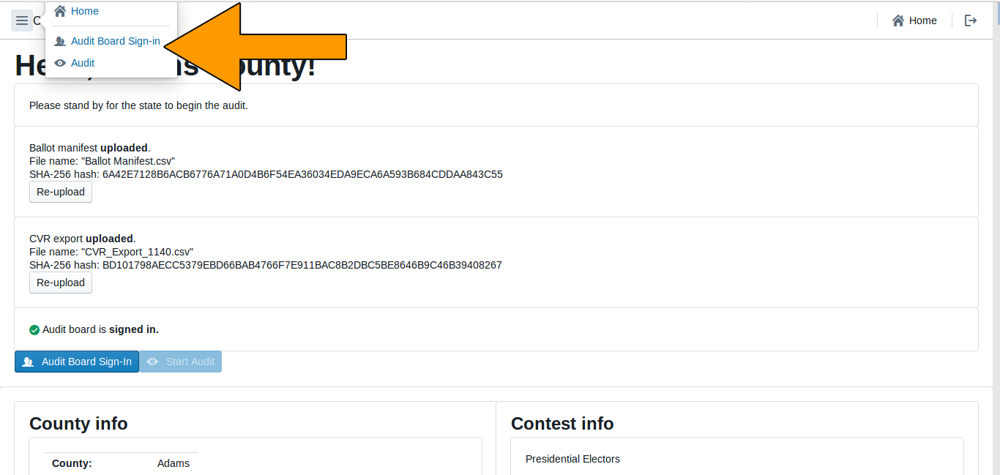
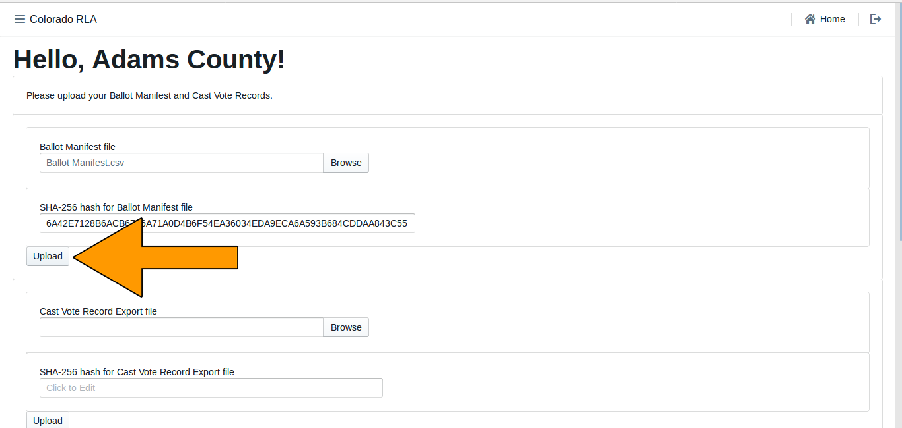
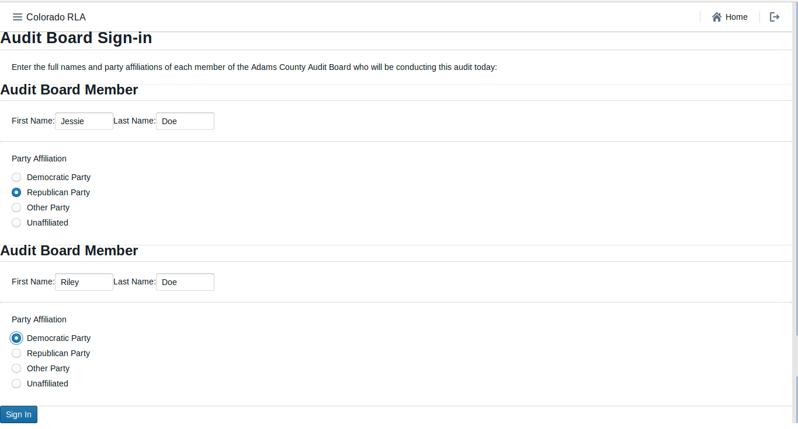
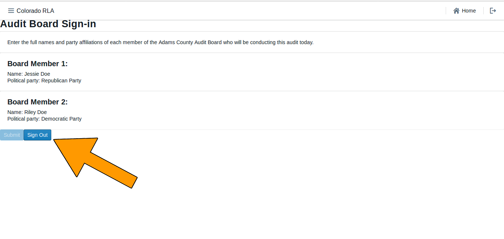

# Colorado Risk Limiting Audit 
# County Run Book

## Introduction

This Run Book guides County election administrators in Colorado who will be
implementing a Risk Limiting Audit (RLA).
The RLA Tool, developed by Free & Fair for the
Colorado Department of State for use in elections in November 2017 and later, 
supports running a Risk-Limiting Audit as required by
Colorado statute and as described in the
[Colorado Secretary of State's Rule 25](http://www.sos.state.co.us/pubs/rule_making/CurrentRules/8CCR1505-1/ElectionRules.pdf) for
elections. 

The RLA Tool helps each County
fulfill the requirements of Rule 25.2.2 and Rule 25.2.3.
First the County uploads verified ballot manifests and cast vote record
(CVR) files. For each round of the RLA, the RLA Tool tells the County which ballot cards to audit, allows the County to enter Audit Boards 
interpretations of the ballot cards and allows the Audit Board to sign off on the round.
 
### Logging In

Persons from the County first must log in to the RLA Tool.

The RLA Tool will direct each user to the appropriate home page. 
County users will see the (initially empty) County home page. Note the 
logout button, circled in the upper right of this (and every) page.

### Navigation

The County site has a navigation menu in the upper left corner.

### 25.2.2 (A), Entering the Risk Limit

The Secretary of State will enter the Risk Limit for comparison
audits.

### 25.2.2 (B) - (E)

These parts of Rule 25 must be completed outside of the RLA Tool.

### 25.2.2 (F) or (G), <a name="comparison-audit-upload">Audit Uploads</a>

To prepare for upload, each county’s ballot manifest and the CVR file must be
first verified and hashed using any SHA-256 hash utility. The RLA Tool
itself does not provide a utility for verification or hashing.

Once the ballot manifest and CVR files are verified and hashed, they
can be uploaded into the RLA Tool. If the upload is interrupted the process 
will have to be repeated. It is not possible to resume interrupted uploads.

If the hash does not match, or the file is not the proper format, users will
receive the following errors.

Once both the ballot manifest and CVR files are successfully uploaded
users will see them both listed as **uploaded**. It is possible to re-upload
either or both files, if necessary.

After successfully uploading both the Ballot Manifest and the CVR
files, the County Dashboard shows the current audit status, including
all contests on all CVRs. Users will not see the estimated number of ballot cards
remaining to be audited to meet the risk limit until the Secretary of State has 
launched the audit.

### 25.2.2 (H), Entering the Random Seed

The Secretary of State will enter the random seed.

### 25.2.2 (I) Selecting Contests

The Secretary of State will select the contests that will drive the
sample size and stop/go decisions for each round.  

#### 25.2.3 (A)(1) Comparison Audits – Audit Board Sign-in

The Audit Board does not log directly into the RLA Tool with usernames
and passwords. However, whenever the Audit Board begins to interact
with the RLA Tool, either at the beginning of an audit round or after
taking a break, there is an informal sign-in process. 

After the authenticated County Audit Administrator formally logs in, there is a
screen where the identity and party affiliation of Audit Board Members is listed
with a sign out button if the audit needs to be paused.

Once the Audit Board is signed in use the navigation panel at the top of the screen
to launch the audit.

### 25.2.2 (J) Number of Ballot Cards to Audit (intial?)

The number of ballot cards to audit changes during the course of the
audit depending on the risk level, which in turn depends on the number
of overstatements (i.e., ballots whose correction by the Audit Board
decreases a margin of victory in one of the selected contests) so
far. If the Audit Board's interpretations match that of the tabulation
software that created the CVRs, then the audit can sometimes complete
early. If there are discrepancies or disagreements, then the number of
ballot cards to audit can grow.

### 25.2.2 (K) Random Selection of Ballot Cards for Audit

Once the audit is launched county users will see a list of ballots to
be audited. The list includes the Scanner #, Batch #, Ballot Positing #,
and Storage Bin #.

These ballots are selected based on the pseudo-random number generator 
and random seed from 25.2.2 (H) and the current risk levels, the RLA Tool 
determines the selection of ballot cards for audit.

### 25.2.3 (A) Ballot Retrieval, Chain of Custody and Examination

Ballot retrieval from storage container and verification of seals
relative to the chain-of-custody logs must be done outside the RLA
Tool.

#### 25.2.3 (A)(1) Comparison Audits – Ballot Verification

The RLA Tool allows Audit Board members to report the markings on each
individual ballot.

Before recording voter intent, please double-check that the paper
ballot ID and Ballot Style match the ID and ballot style listed on the
screen.  Then record on the screen all final voter intent marked on
the paper ballot.  

In case of an overvote, mark each of the (too many or too few) choices the 
voter intended; the RLA tool will recognize overvotes and undervotes. In 
case the Audit Board cannot reach consensus, mark the "No Consensus" 
box on the screen.  

Audit Board members can make notes in the comment field.

If a ballot card is not found click the Ballot Card Not Found Button.

After entering the interpretation of the markings from any one ballot,
the Audit Board can review what was entered.

Check that the information on the review screen reflects the Audit
Board's interpretation of the ballot. Note that in case of an
overvote, the review screen will say, simply, "overvote".

If the review screen matches the Audit Board's interpretation, click
"Submit and Next Ballot". This submission is final. There is no way to
revise a ballot interpretation once it has been submitted from the
Review Screen. The next ballot will then be displayed and the process
continues until the RLA tool determines the risk limit has been met. HOW ARE THEY NOTIFIED?

Note: do *not* use your browser's "back" arrow during the audit
process.  If the review screen does not match the Audit Board's
interpretation, click the "Back" button.

### 25.2.3 (A)(2) Ballot Polling Audits

The conduct and reporting of the Audit Board for a Ballot Polling
Audit must be completed outside the RLA Tool.

### 25.2.3 (B) Non-Unanimous Audit Board

An Audit Board can use the RLA Tool to report lack of consensus on any
particular contest on any particular ballot.

### 25.2.3 (C) Comparisons, Termination, Additional Ballots

The RLA Tool performs the comparison of the Audit Board's
interpretations with the corresponding cast vote record from the
voting computer system. RLA Tool permits the Secretary of State and
County Administrators to see the progress of audit for selected
contests and the estimated number of ballot cards remaining to be
audited to meet the risk limit. COUNTIES DON’T SEE THIS, DO THEY?

The RLA Tool automatically randomly selects additional ballots for
audit as necessary.

### Audit Board Intermediate Audit Report Page

If the Audit Board needs to take a break, go to lunch, head home for
the night, or change, then the Audit Board must file an "Intermediate
Audit Report" on their auditing. They should use the Sign Out button
On the Audit Board Sign-in Page

### Audit Board Final Audit Report Page

After the RLA Tool deems that a County's audit is complete, the Audit
Board must file an "Final Audit Report" on their audit. *(Ed. note: A
button for filing such a report will be available on the **Audit Board
Interpretation Page** in the phase-3 release.)*
