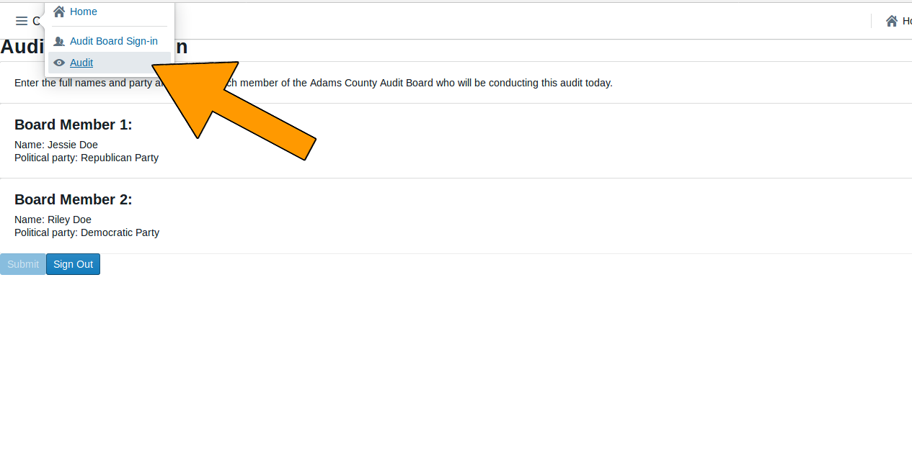
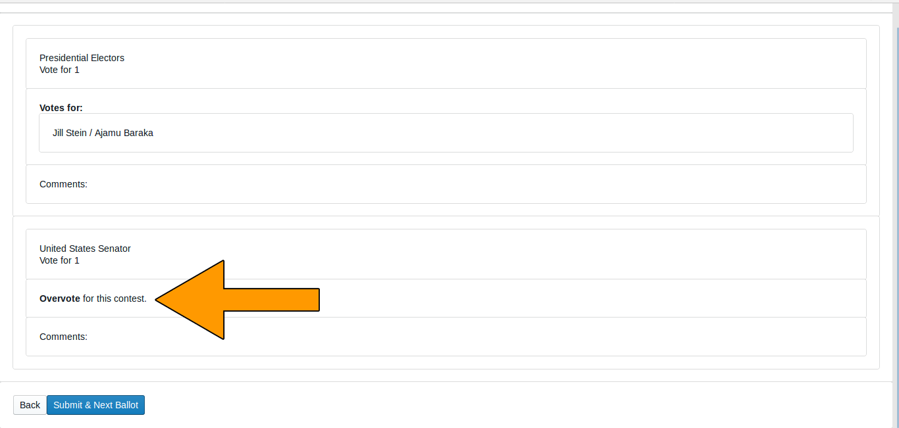

# Colorado Risk Limiting Audit 
# County Run Book

## Introduction

This Run Book guides County election administrators in Colorado who will be
implementing a Risk Limiting Audit (RLA) with a comparison audit.
The RLA Tool, developed by Free & Fair for the
Colorado Department of State for use in elections in November 2017 and later, 
supports running a Risk-Limiting Audit as required by
Colorado statute and as described in the
[Colorado Secretary of State's Rule 25](http://www.sos.state.co.us/pubs/rule_making/CurrentRules/8CCR1505-1/ElectionRules.pdf) for
elections. 

The RLA Tool helps each County
fulfill the requirements of Rule 25.2.2 and Rule 25.2.3.
First the County uploads verified ballot manifests and cast vote record
(CVR) files. For each round of the RLA, the RLA Tool tells the County which ballot cards to audit, allows the County to enter Audit Boards 
interpretations of the ballot cards and allows the Audit Board to sign off on the round.

Orange arrows on the screenshots indicate features described in the text of the Runbook.
 
### Logging In

A County user can log in to the RLA Tool by pointing a browser to the URL provided by the Colorado Department of State. **[SCREENSHOT NEEDS UPDATE]**

***

County users will see the County home page. Note the 
logout button , in the upper right of this (and every) page.

### Navigation

The County site has a navigation menu in the upper left corner.

### 25.2.2 (F), <a name="comparison-audit-upload">Audit Uploads</a>

To prepare for upload, the County's ballot manifest and CVR files must each be
 hashed using any SHA-256 hash utility. The RLA Tool
itself does not provide a utility for verification or hashing. 

Once the ballot manifest and CVR files are hashed, they
can be uploaded into the RLA Tool. If the upload is interrupted the process 
will have to be repeated. It is not possible to resume an interrupted upload — just start that file upload again. 
If a County uploads multiple Ballot Manifest files, only the data from the last
file will be used. Similarly, if a County uploads multiple CVR files, only the data from the 
last file will be used.

***

If the hash does not match the file 
(either because the wrong hash was entered, or because the file was changed as it traveled over the network), 
the data from the file will be uploaded but the data will not be imported. The user will
see the following messages. 

If the hash matches the file but the file is not in the proper format, the data from the file will not be 
imported. The user will
see the following messages. 

If the hash matches and the file format is correct,  the system will import the data from the file. The user will see the following messages.

The time required for data import depends on the size of the file. Import time for the CVR file will depend on the 
number of ballot cards represented in the file. A file with fewer than 10,000 CVR lines should take less than a minute,
while a file with 500,000 CVR lines or more might take about a half hour. The ballot manifest file upload and import will be quicker than the CVR file upload and import.

Once both the ballot manifest and CVR files are successfully uploaded and imported
users will see them both listed as **uploaded**. It is possible to re-upload
either or both files, if necessary.

After successfully upload and import of both the Ballot Manifest and the CVR
files, the County home page shows the status of ballot cards and 
all contests on all CVRs. 
<!--- add comment about how this changes based on SoS behavior? --->

### 25.2.3 (A)(1) Audit Board Sign-in

The Audit Board does not log directly into the RLA Tool with usernames
and passwords. However, whenever the Audit Board begins to interact
with the RLA Tool, either at the beginning of an audit round or after
taking a break, there is an informal sign-in process. 

After the authenticated County Audit Administrator formally logs in, there is a
screen where the identity and party affiliation of Audit Board Members is listed
with a sign out button if the audit needs to be paused.

Once the Audit Board is signed in use the navigation panel at the top of the screen
to launch the audit.

### 25.2.2 (K) Audit Rounds

Once the Secretary of State launches the audit the County user will see a list of ballots to
be audited in the current round. The list includes the Scanner #, Batch #, Ballot Position #,
and (if available) the Storage Bin.

### 25.2.3 (A)(1) and (B) Ballot Verification

The RLA Tool allows Audit Board members to report the markings on each
individual ballot.
Before recording voter intent, please double-check that the paper
Ballot Type matches the Ballot Type listed on the
screen.   

If a ballot card is not found click the Ballot Card Not Found Button.

Otherwise record on the screen all final voter intent marked on
the paper ballot card. 

In case of an overvote, mark each of the (too many) choices the 
voter intended; the RLA tool will recognize overvotes and undervotes. 
If the Audit Board cannot reach consensus, mark the "No Consensus" 
box on the screen.  

Audit Board members can make notes in the comment field.

After entering the interpretation of the markings from any one ballot,
the Audit Board can click the Review button.

On the Review screen, check that the information on the review screen reflects the Audit
Board's interpretation of the ballot. Note that in case of an
overvote, the review screen will say "Overvote for this contest".

If the review screen does not match the Audit Board's
interpretation, click the "Back" button.
If the information on the review screen is correct, click "Submit & Next Ballot".
This submission is final. There is no way to
revise a ballot interpretation once it has been submitted from the
Review Screen. 

The next ballot will then be displayed and the process
continues until the end of the round, when the screen will show the 
end-of-round page, with boxes for the Audit Board to "sign" their approval of the round by entering their names as indicated. 

### County Home Page During Audit

Note that while the audit is in progress, the County Home page 
gives a summary of progress. The County Info table shows how many Ballot 
Cards are required for the current round, and how many have already 
been audited. The number of "disagreements" is the number of ballot cards on 
which the Audit Board could not come to complete consensus. The number of 
"discrepancies" is the number of ballot cards where the Audit Board's 
interpretation differs from the interpretation in the uploaded CVR file, or 
where the ballot card in question could not be found.

### Audit Board Intermediate Audit Report Page

If the Audit Board needs to take a break, go to lunch, head home for
the night, or pause their work for any reason, then the Audit Board must file an "Intermediate
Audit Report" on their auditing. They should use the Sign Out button
On the Audit Board Sign-in Page.

### Audit Board Final Audit Report Page

After the RLA Tool deems that a County's audit is complete, the Audit
Board must file an "Final Audit Report" on their audit. *(Ed. note: A
button for filing such a report will be available on the **Audit Board
Interpretation Page** in the phase-3 release.)*  [SCREENSHOT NEEDS UPDATE]

