# Colorado Risk Limiting Audit 
# User Manual

This User Manual provides an overview of the components that comprise 
the Colorado Department of State’s (CDOS) Risk Limiting Audit Tool (RLA Tool). 
It contains annotated screenshots with detailed descriptions of what is 
contained on every page users will experience. It also contains a glossary 
of relevant terms. This RLA Tool represents the cutting edge in efforts to 
provide verifiable evidence that election results are accurate, and November 
2017 is the first time any state or jurisdiction has implemented them on a 
widescale basis.

## Basic Structure of Risk Limiting Audits

Once the Secretary of State establishes a risk limit and selects contests to 
be audited, counties will then use the RLA Tool to upload ballot manifests, 
cast vote records (CVRs), and summary results to a central server. The RLA 
Tool will use this data to determine the initial set of ballots to be checked 
for each contest based on the risk limit and the margins of victory in the 
contests to be audited. The RLA Tool will report this information to each 
county, where the Audit Board, consisting of representatives of different 
political parties, will retrieve the appropriate ballots and record their 
interpretations of voter intent in the RLA Tool. If there are too many 
mismatches between the Audit Board’s interpretations and the choices 
reported by the vote-tallying system, additional ballots may need to be 
randomly selected until either the risk limit is satisfied or a complete 
hand count is conducted. Complete audit results are exported from the RLA 
Tool for import to a Public Audit Center hosted on the official CDOS website.

## RLA Tool

The RLA Tool facilitates running a risk limiting audit across all counties 
in Colorado simultaneously. The RLA Tool has two dashboards. One dashboard 
serves CDOS, and the other serves the Counties. Both the CDOS and County 
dashboards require authentication to login. The RLA Tool also provides 
information to be used for a Public Audit Center, but does not contain it.

### Logging In

On this page authorized users from the Secretary of State's office, as well as 
persons from the County can enter their login credentials to access the RLA Tool’s 
Dashboards.

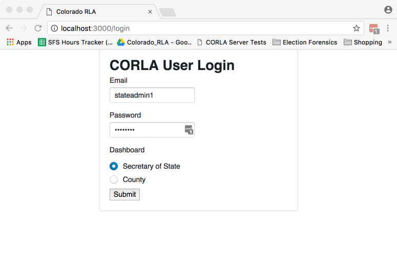

---

Once logged in, users from the Department of State will see the Department of 
State home page.

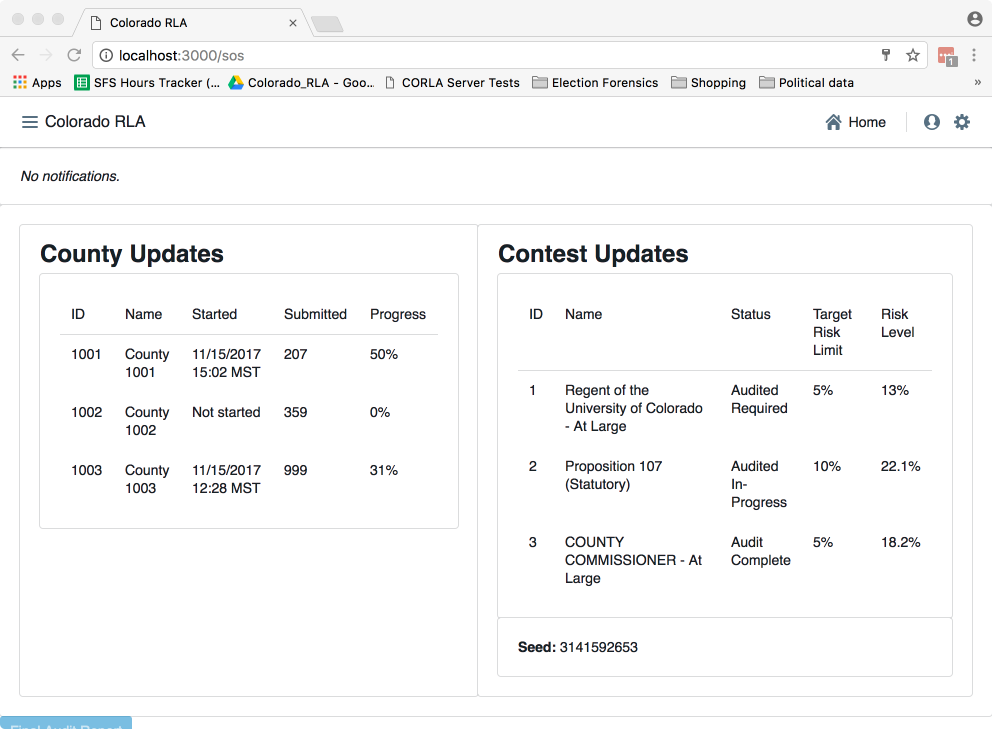

---

Logged in County users will see a home page tailored to that County.

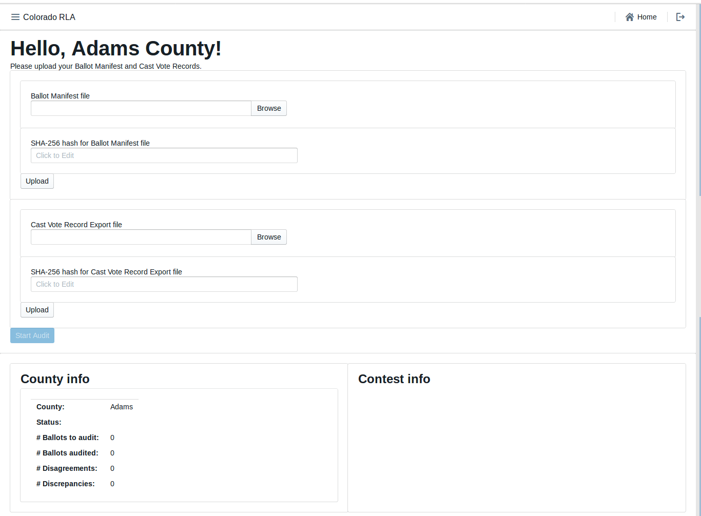

---

### Navigation

Both the Secretary of State site and each County site has a navigation menu 
in the upper left corner.

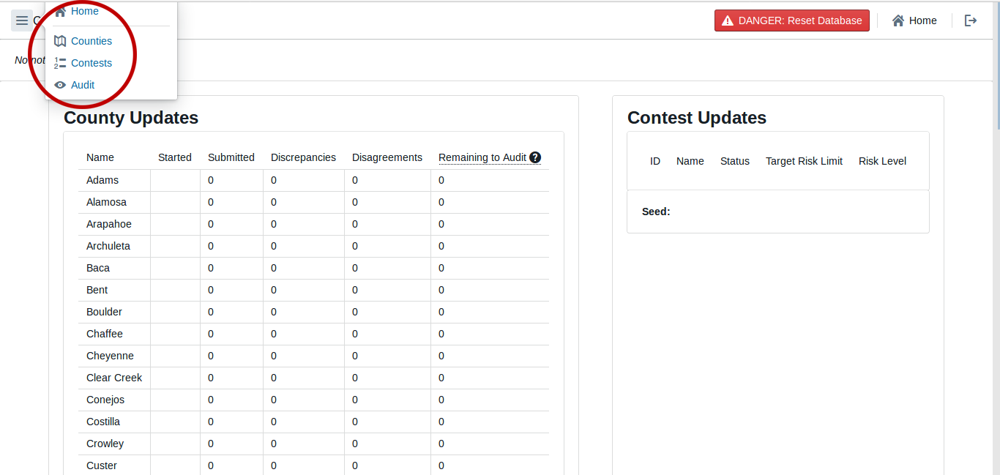

---

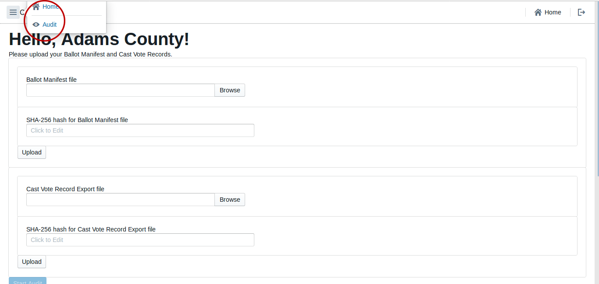

---

### 25.2.2 (A), Entering the Risk Limit

On this page the Sectretary of State will enter the Risk Limit for comparison audits.

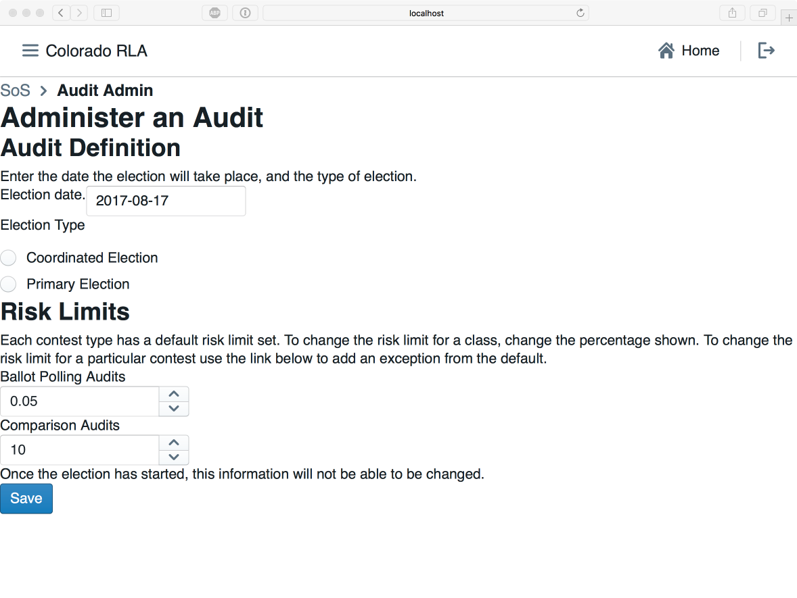

---

### 25.2.2 (F) or (G), Audit Uploads

On this page county officials can upload their hashed Ballot Manifest and CVR files.

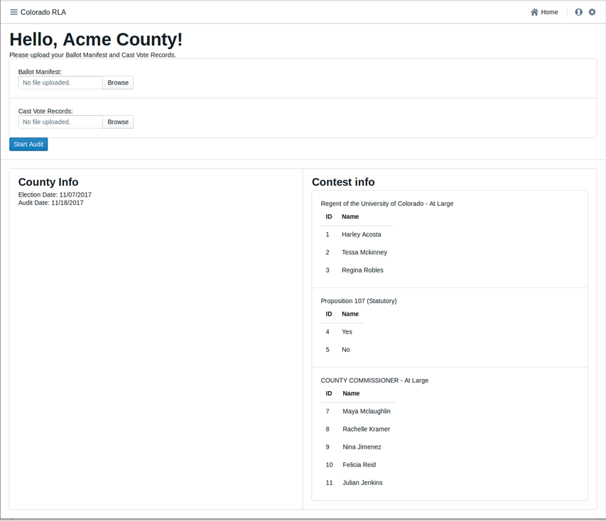

---

### 25.2.2 (H), Entering the Random Seed

This page allows the Secretary of State Once to enter the random seed, which 
is a 20 digit number chosen during a public ceremony. Once entered, this will 
trigger the random selection of which ballots to audit, which will be listed 
on the following page, and will be published to the County and Public Dashboards.

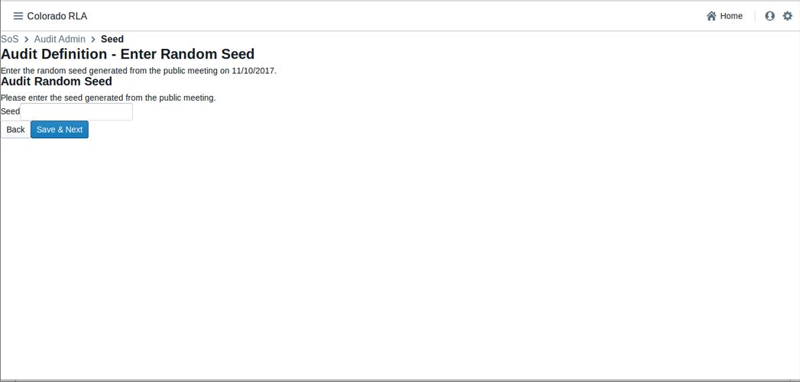

---

### 25.2.2 (I) Selecting Contests

This page allows the Secretary of State to select which statewide contest, and 
which countywide contests to audit. This information will be published to the 
County Dashboard when the selections have been made.

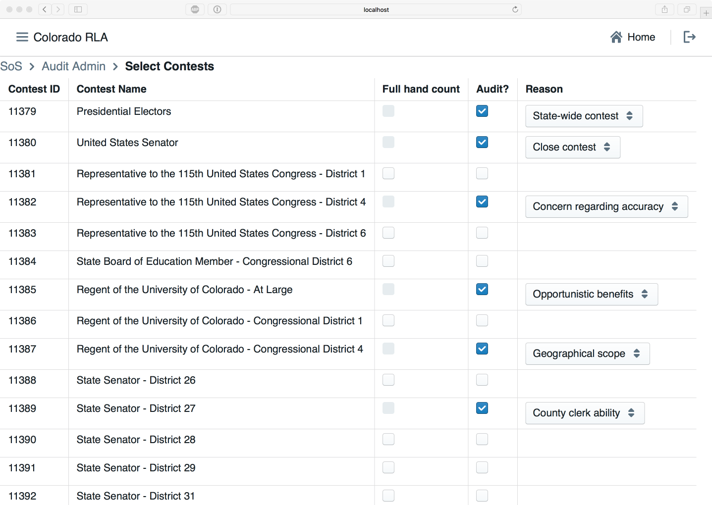

---

#### 25.2.3 (A)(1) Comparison Audits

On this page authorized Audit Board members can sign into the system to conduct 
the audit.

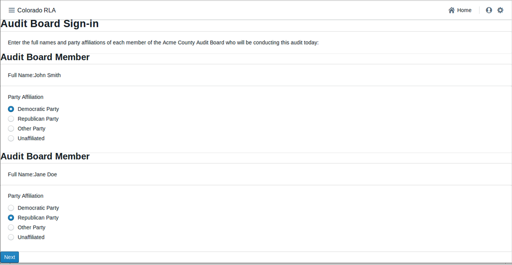

---

The RLA Tool allows Audit Boards to report the markings on each individual ballot.

This page allows Audit Board members to enter their collective interpretation 
of choices marked on the ballot. Once they have entered their interpretations, 
Audit Board members click ‘Review.’’ to be taken to the Audit Board Interpretation 
Review Screen.

Click "Review"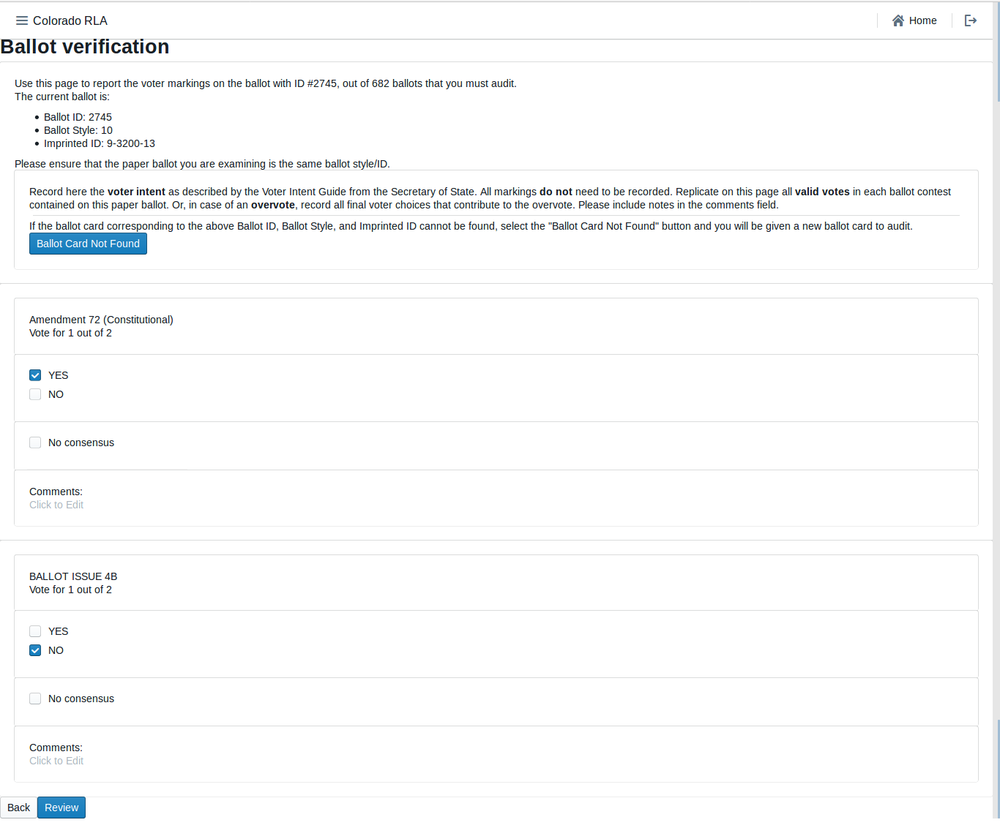

---

This page allows Audit Board members to review their choices, and then 
‘Submit and Next Ballot’ when ready to proceed to the next ballot. This 
process continues until all of the ballots for the batch are entered.
 This submission is final. There is no way to revise a ballot interpretation 
 once it has been submitted from the Review Screen.

Note: do *not* use your browser's "back" arrow during the audit process.
If the review screen does not match the Audit Board's interpretation,
click the "Back" button.

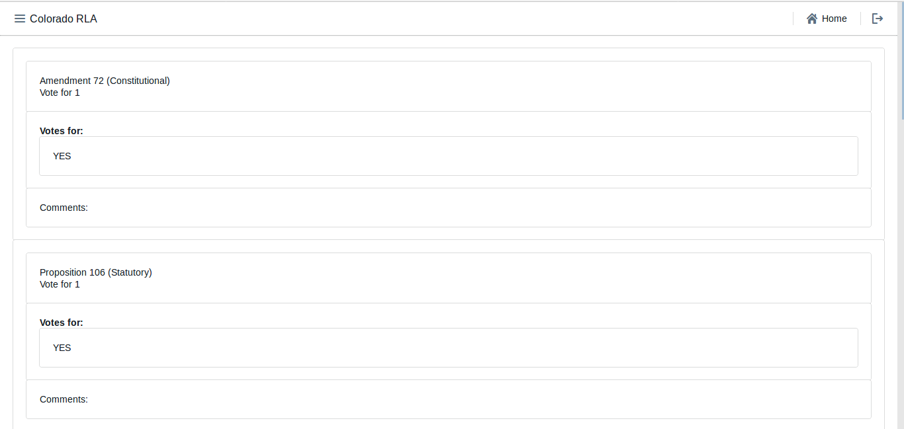

----

## Glossary

========

See also the working documents at [VVSG-Interoperability Voting Glossary](http://collaborate.nist.gov/voting/bin/view/Voting/Glossary)
and the glossary in: ["Risk-Limiting Post-Election Audits: Why and How"](https://www.stat.berkeley.edu/~stark/Preprints/RLAwhitepaper12.pdf)

* **RLA Tool** A computer system for conducting a
Risk Limiting Audit

* **business interruption** - Any event that disrupts Contractor’s
ability to complete the Work for a period of time, and may include,
but is not limited to a Disaster, power outage, strike, loss of
necessary personnel or computer virus.

* **closeout period** - The period beginning on the earlier of 90 days
prior to the end of the last Extension Term or notice by the State of
its decision to not exercise its option for an Extension Term, and
ending on the day that the Department has accepted the final
deliverable for the Closeout Period, as determined in the
Department-approved and updated Closeout Plan, and has determined that
the closeout is complete.

* **deliverable** - Any tangible or intangible object produced by
Contractor as a result of the work that is intended to be delivered to
the State, regardless of whether the object is specifically described
or called out as a “Deliverable” or not.

* **disaster** - An event that makes it impossible for Contractor to
perform the Work out of its regular facility or facilities, and may
include, but is not limited to, natural disasters, fire or terrorist
attacks.

* **key personnel** - The position or positions that are specifically
designated as such in this Contract.

* **operational start date** - When the State authorizes Contractor to
begin fulfilling its obligations under the Contract.

* **other personnel** - Individuals and Subcontractors, in addition to Key
Personnel, assigned to positions to complete tasks associated with the
Work.

* **start-up period** - The period starting on the Effective Date and
ending on the Operational Start Date.

% @todo kiniry Does the ballot manifest list ballots or ballot cards?

* **ballot manifest** - A document that describes how ballot cards are
organized and stored, and relates a Cast Vote Records to the physical
location in which the tabulated ballot card is stored. The ballot
manifest specifies the physical location of a ballot card to allow
staff to find the specific ballot card represented by a given CVR. A
ballot manifest will contain the following information: county ID,
tabulator ID, batch ID, the number of ballot cards in each batch, and
the storage location where the batch is secured following
tabulation. A sample ballot manifest is provided
at [`manifest-dq.csv`](samples/manifest-dq.csv)

* **cast vote record (CVR)** - An electronic record indicating how the
marks on a ballot card were interpreted as votes.  May be created by a
scanner or DRE, or manually during an audit.  Sample CVRs in
Dominion's format are in
`test/dominion-2017-CVR_Export_20170310104116.csv`.  See
also
[VVSG-Interoperability CVR Subgroup](http://collaborate.nist.gov/voting/bin/view/Voting/BallotDefinition).

* **contest** - Any decision to be made by voters in an election,
such as a partisan or nonpartisan candidate race, or a
ballot measure.  Ex: Jane Doe for Colorado Secretary of State. Each option
for the voter is called a *choice*.

* **choice** Any possible outcome of a Contest. In a Contest to
determine who will fill a certain office, each choice is a person, 
called a candidate for the office. In a ballot question contest, 
the choices are "Yes" and "No".

* **coordinated election** - Coordinated Elections occur on the first
Tuesday of November in odd-numbered years.  If the Secretary of State
certifies at least one statewide ballot measure to the counties, every
county will conduct the Coordinated Election, and the vast majority of
counties will include additional local ballot content in the election.
If the Secretary of State does not certify at least one statewide
ballot measure to the counties, then only those counties to which
local political subdivisions certify ballot content will conduct a
Coordinated Election in that year.

* **county administrator** - The designated representative(s) of each
county clerk and recorder who possesses RLA administrative user
privileges sufficient to upload a cast vote record and ballot manifest
for the county.

* **contest name** - The title of a contest.

* **election day** - The final day on which voters can cast a ballot in a
State Primary Election, Presidential Primary Election, Coordinated
Election, or General Election.

* **offeror** - A vendor that submits a responsible bid for this
Documented Quote.

* **pseudo-random number generator** - A random number generator
application that is further explained at
http://statistics.berkeley.edu/~stark/Java/Html/sha256Rand.htm
Test data is available at https://github.com/cjerdonek/rivest-sampler-tests

* **random seed** - A random seed (or seed state, or just seed) is data, such
as a number, vector or string, used to initialize a pseudorandom number generator.

* **responsible bid** - A bid from a vendor that can responsibly
(i.e. is reasonably able and qualified) do the work stated in the
solicitation.

* **risk-limiting audit (RLA)** - A procedure for manually checking a
sample of ballot (cards) (or other voter-verifiable records) that is
guaranteed to have a large, pre-specified chance of correcting the
reported outcome if the reported outcome is wrong. (An outcome is
wrong if it disagrees with the outcome that a full hand count would
show.) One paper describing risk-limiting audits is located at
https://www.stat.berkeley.edu/~stark/Preprints/gentle12.pdf.

* **state administrator** - The designated person who possesses RLA administrative user
privileges to perform administrative tasks.

* **tabulation** - Aggregation of tallies of interpretations of voter choices
into election results. @review NIST Election Modeling group 
separates interpretation, tally and tabulation. 

* **tabulated ballots** - Paper ballot cards that have been scanned on
a ballot scanning device, and the voter’s markings on which have been
interpreted by the voting system as valid votes, undervotes, or
overvotes.  Tabulated ballots may be duplicates of original
ballots. @review this means ballots counted by hand weren't
"tabulated". Is that what we want to say?

* **two-factor authentication** - Defined as two out of the three
following requirements:
  * Something you have (Examples: token code, grid card) 
  * Something you know (Example: passwords)
  * Something you are (Example: biometrics)

* **ENR system** An Election Night Reporting system, a computer system
enabling publication of election results starting on election night, and
continuing through the end of certification.

* **reported outcome** - The set of contest winners published by the ENR
system.

* **calculated outcome** - The set of contest winners according to the
CVRs that are being audited.

* **wrong outcome** - When the reported outcome for a given contest does
not match the outcome that a full hand count of the paper ballots would show.
This can happen due to equipment failures, adjudication errors, and other
reasons.

* **full hand count** - TBD along these lines: A procedure for
determining the correct outcome of a contest, suitable for use in an
RLA. It involves a tabulation of the votes for each choice in a contest
which involves manual interpretation of each ballot, and may involve
verifiable machine assist with checking the counts. See one suggested
procedure at
[Branscomb full hand countproposal](http://www.sos.state.co.us/pubs/rule_making/written_comments/2017/20170718BranscombMcCarthy.pdf).
Cf. *recount*.

* **recount** TBD, a procedure under Colorado law that happens *after*
certification if the margin is too tight, or if a candidate requests
it. A recount doesn't have to involve manual interpretation of each
ballot.  Cf. *full hand count*.

* **overstatement of the margin** An error whose correction reduces the margin
https://www.stat.berkeley.edu/~stark/Preprints/evidenceVote12.pdf

* **understatement of the margin** An error whose correction increases the margin
https://www.stat.berkeley.edu/~stark/Preprints/evidenceVote12.pdf

* **evidence-based elections** - An approach to achieving election integrity
in which each election provides affirmative evidence that the reported
outcomes actually reflect how people voted. This is done via
software-independent voting systems, compliance audits and risk-limiting
audits.  An alternative to certifying voting equipment and hoping that it
functions properly in real elections.  See also *resilient canvass
framework*.  See
[Evidence-Based Elections - P.B. Stark and D.A. Wagner](https://www.stat.berkeley.edu/~stark/Preprints/evidenceVote12.pdf)

* **resilient canvass framework** - A fault-tolerant approach to conducting
elections that gives strong evidence that the reported outcome is correct,
or reports that the evidence is not convincing.  See also *evidence-based elections*.

* **compliance audit** - An audit which checks that the audit trail is
sufficiently complete and accurate to tell who won. Generally includes poll
book accounting, ballot accounting, chain of custody checks, security
checks, signature verification audits, voter registration record auditing,
etc.  Related terms include election canvass, ballot reconciliation.
See https://www.stat.berkeley.edu/~stark/Preprints/evidenceVote12.pdf

* **audit board** - Given a County, a group of electors in the county nominated
by the major party chairpersons, which carries out an audit, with the assistance
of the designated election official, members of his or her staff, and other
duly appointed election judges.

* **audit** A process by which the performance or outcome of a system is
verified. @review TBD May include ballot tabulation audits, compliance audits, ...

* **RLA** Risk Limiting Audit

* **Risk Limiting Audit** An Audit designed to reduce the statistical
probablility that a wrong election winner was determined by an 
interpretation and tabulation system.

* **ballot tabulation audits** An Audit of a vote-tabulation system. 
@review TBD. including risk-limiting audits, opportunistic audits,
bayesian audits, fixed-percentage audits, etc. @review if we honor the
NIST Election Modeling Group distinction between interpretation and
tabulation, this definition describes a "ballot interpretation and
tabulation audit"

* **opportunistic audit** - An auditing technique designed to efficiently
generate evidence for additional contests in a ballot-level audit. A
significant part of the effort in doing a risk-limiting audit involves
physically retrieving the ballots selected for audit.  While doing the
manual tabulation and entering the data for the contests on that ballot
which are subject to strict risk limits, it is possible to
"opportunistically" do the same thing for other contests that are observed
on the same ballot, producing evidence about them for little additional
effort.  These are called "opportunistic contests".  If an opportunistic
contest achieves a risk limit, it can be "settled", and when it appears
on subsequent ballots during the audit, it need not be tabulated.
TBD: discuss need to consider possibility of sampling bias when
evaluating and reporting, considerations for possible escalation, etc.

* **mandatory contest** - A Contest in a Risk Limiting Audit which is
subject to a Risk Limit and hence is factored in to the sampling calculations.

* **opportunistic contest** - A contest to be audited opportunistically.

* **Risk Limit Goal** In a Risk-Limiting Audit, each Contest has a Risk-Limit
Goal, namely, the acceptable risk that an incorrect outcome will escape notice.

* **Dynamic Risk** In a Risk-Limiting Audit in progress, for any specific
Contest Under Audit, at any given time the Dynamic Risk is the probability,
based on Ballots audited so far, that an incorrect outcome of the Contest 
as escaped notice.

* **Under Audit** A Contest that has been chosen for audit.

* **active contest** At any given time, a Contest Under Audit whose Dynamic
Risk exceeds the Risk Limit Goal @review this is just a guess @review what's
the origin of this term? Couldn't find it in Stark or Lindeman/Stark.

* **settled contest** At any given time, a Contest Under Audit 
whose Dynamic Risk is less than or equal to the Risk Limit Goal
@review TBD involving having achieved Risk Limit Goal.  Note need
to ensure that calculations take into account the way the samples were
selected, in case any samples were taken in a stratified manner or taken
non-uniformly in order to target non-county-wide contests.

* **uncontested contest** A Contest for which the number of choices is 
less than or equal to the number of winners @review Consider a contest
with three winners where each voter can vote for two. Are we OK calling
that an "uncontested contest"?

* **bayesian audits** @review Neal McBurnett

* **voting method** TBD

* **electoral system** the method used to calculate the number of
elected positions in government that individuals and parties are
awarded after elections.

* **ballot** a list of contests and, for each contest in the list, a
list of choices, in a form that allows a person to record choices and
allows a person or a computer (or both) to read recorded choices.
Each ballot is composed of one or more ballot cards, and each ballot
card has a unique ID.

* **ballot card** a single physical page of a ballot.

* **margin** Given a contest and two choices in that contest, the
  numerical difference between the choice that got more votes and the
  choice that got fewer votes.

* **hash function** TBD, mentioning specifically SHA-256

* **RLA software** The software component of an RLA Tool.

* **ballot storage bin** A physical container for a set of paper
  ballot cards.

* **batch** A set of Ballot Cards which has a numeric id and a size
  (the number of Ballot Cards contained in the batch).

* **batch id** Each Batch has a unique Ballot Identifier.

* **batch size** the size of a batch, and virtually all batches are
  identically sized.

* **chain of custody** Given an item (e.g., Marked Ballots, Unmarked
Ballots, Ballot Cards) in need of security over a certain time period,
the chain of custody is the sequence of people, organizations or
locations where the item remains secured over the given time period.

* **county** (in the US) a political and administrative division of a
  state, providing certain local governmental services, including 
  conducting elections.

* **scanner** A machine that can take Paper Ballots as input and whose
output is a CVR for each Paper Ballot.

* **imprinted ballot** - A Paper Ballot Card on which a unique Ballot
Card identifier has been imprinted in order to facilitate a Ballot
Card-level audit. The unique Ballot Card identifier might for instance
include a unique Batch Identifier and the sequence of the Ballot Card
within the Batch, or it might be a new identifier which is also
included in the CVR. Imprinting should be done after the ballot card
is cast and with care taken to avoid causing anonymity problems.

* **ballot order** A specific ordering of a set of Ballot Cards.

* **Secretary of State (SOS)** In most states in the United States, an
office of government defined in the state constitution.

* **Department of State (DOS)** An agency of government which, in most
states of the United States of America, is charged with oversight of
state elections.

* **audit report** TBD

* **SOS audit form** TBD

* **ballot certification** TBD

* **UOCAVA voter** A person entitled to cast a UOCAVA Ballot

* **UOCAVA ballot** A certain type of absentee ballot prescribed by the federal
Uniformed and Overseas Citizens Absentee Voting Act and codified in 52 USC Ch. 203.

* **mail ballot** A Paper Ballot that may be cast by physical delivery 
to the Board of Elections, usually via the US Postal Service.

* **election canvass** The process of counting and verifying, or “canvassing,”
the various precinct votes and making determinations on the election results.

* **canvass board** The body which conducts the election canvass and certifies
the winners of county and local offices, as well as certifies county vote totals
for state and federal offices that extend beyond the county limits.

* **post-election (historical, random) audit** Traditional post-election audits
typically entail randomly selecting a few precincts or voting machines, and checking
the associated results with a hand count of the paper ballots. While these audits do
provide some evidence that the machines have correctly interpreted voters’ intent,
they audit only a few samples, often using an artificially created subset of results,
rather than the actual election results.

* **county clerk** An office of County government, established by the Colorado
Constitution (Article XIV, Section 8) and responsible for conducting elections in
the County.

* **sample size** TBD including **initial sample size**

* **equipment** TBD

* **VVPAT** - A Voter-Verifiable Paper Trail consists of an audit trail
of Voter-Verifiable Paper Records (VVPRs). Elections which produce a
VVPAT allow an audit to gather evidence which the voter had an
opportunity to verify.  The VVPRs may appear in a continuous roll
of paper used to provide auditability for a DRE.

* **VVPR** - A Voter-Verifiable Paper Record, also known as a
Voter-Verifiable Paper Ballot (VVPB). 'Voter-verified' refers to the
fact that the voter is given the opportunity to verify that the choices
indicated on the paper record correspond to the choices that the voter
has made in casting the ballot. Risk-limiting audits require VVPRs.

* **non-voter-verifiable ballot** (NVVB) - A ballot for which there is
no auditable VVPR.  For example a ballot sent via an online ballot
return system or email, for which the voter has not returned a matching
voter verifiable paper ballot. AKA digital ballot.

* **phantom ballot** An entry in the Ballot Manifest for which
there is no corresponding Paper Ballot Card. Phantom ballots can represent
pancies between the manifest and the actual paper ballot card batches.
A manifest with a batch of purely phantom ballots can also be used
to represent the maximum number of possibly late-tabluation ballots.

* **late-tabulation ballot** - A ballot which is tabulated after the CVR
report and manifest are generated, but before the canvass is finished.

* **duplicated ballot** A Ballot marked by an Election Official by copying
voter choices from another Ballot.

* **original ballot** A Ballot from which a Duplicated Ballot has been created.

* **DRE** A voting system whose primary record of voter intent is an electronic
record created by a voter's physical interaction with a voting machine.

* **votes allowed** Given a Contest, the maximum number of choices a voter may
legitimately select in that Contest.

* **overvote** Given a Marked Ballot and a Contest, a selection of more choices
than the Votes Allowed for that Contest.

* **stray mark** A Ballot Mark that does not carry any information about voter
intent.

* **damage** TBD

* **undervote** Given a Marked Ballot and a Contest, a selection of fewer choices
than the Votes Allowed for that Contest.

* **risk limit** - The pre-specified minimum chance of requiring a full
hand count if the outcome of a full hand count would differ from the
reported tabulation outcome.

* **voting system** TBD 

* **Dr. Philip Stark** Associate Dean, Division of Mathematical and 
hysical Sciences, Professor of Statistics, University of California.
https://www.stat.berkeley.edu/~stark/

* **Dr. Mark Lindeman** Mark Lindeman is a political scientist who
studies public opinion and elections. He presently lectures at Columbia
University in quantitative methods, and led the revision of Carroll Glynn
et al.’s multidisciplinary textbook Public Opinion. https://electionverification.org/aee-statistics-and-auditing/

* **Dr. Ron Rivest** Professor Rivest is an Institute Professor at MIT.
He joined MIT in 1974 as a faculty member in the Department of Electrical
Engineering and Computer Science. He is a member of MIT's Computer Science
and Artificial Intelligence Laboratory (CSAIL), a member of the lab's Theory
of Computation Group and a founder of its Cryptography and Information
Security Group. He is a co-author (with Cormen, Leiserson, and Stein) of
the text, Introduction to Algorithms. He is also a founder of RSA Data
Security, now named RSA Security (the security division of EMC), Versign,
and Peppercoin. Professor Rivest has research interests in cryptography,
computer and network security, electronic voting, and algorithms.
http://people.csail.mit.edu/rivest/

* **Colorado House Bill 09-1335** an act of the Colorado Legislature concerning
requirements for voting equipment.

* **EAC** An independent, bipartisan commission of the United States Federal
Government, established by the Help America Vote Act of 2002.

* **Clear Ballot Group** An election technology
  company. https://www.clearballot.com/

* **Clear Ballot ClearCount** Clear Ballot Group's browser-based
central count tabulation, consolidation and reporting system.

* **OpenCount** OpenCount is a system that can interpret scanned paper
ballots and interpret them into cast vote records.  It can understand
some of the existing proprietary file formats for other vendors’
equipment, and can semi-automatically figure out the shape and nature
of a ballot with a little help from an elections official. OpenCount
was originally designed and implemented at Berkeley under the guidance
of Prof. David Wagner.

* **Dominion** Dominion Voting Systems is an election technology company.
http://www.dominionvoting.com/

* **Dominion Democracy Suite** Dominion's election management system for setting up
an election as well as acquiring, tallying and reporting election results.

* **dashboard** A computer user interface.

* **developer dashboard** TBD

* **state-wide dashboard** A Dashboard enabling the Secretary of State to carry out
actions required by the Risk Limiting Audit process.

* **county dashboard** A Dashboard enabling County election officials to carry out
actions required by the Risk Limiting Audit process.

* **audit progress** TBD

* **discrepency** Given a Contest and an audited ballot, an integer between -2 and 2
(inclusive) indicating the amount to be added to the margin of victory due to the
difference between the audited interpretation and the CVR.

* **random** TBD

* **contest margin** The Margin between the winning choice with the least votes of
all winning choices and the losing choice with the most votes among all losing choices.

* **access control** TBD

* **role** TBD

* **fault tolerance** TBD

* **user interface (UI)** The means by which the user and a computer system interact, in
particular the use of input devices and software.

* **user experience (UX)** The overall experience of a person using a product such as a
website or computer application, especially in terms of how easy or pleasing it is to use.

* **data synchronization** TBD

* **Colorado Department of State (CDOS)** An agency of Colorado state government created
by C.R.S. Title 24 Article 21.

* **abstract state machine** (AST) - TBD including [Abstract state machine](https://en.wikipedia.org/wiki/Abstract_state_machines)

* **audit center** (aka the public interface to the system) TBD

* **public audit meeting** The meeting where the random seed (and possibly more) is 
determined.
  
* **working group** TBD

* **regional training** TBD

* **list of ballot cards to audit** An ordered list of ballot cards
  selected for audit by the Risk-Limiting Audit algorithm

* **uploading interface** A part of the county dashboard.

* **authenticate** (also known as log-in)

* **comma separated value** (aka CSV)

* **county number** each county has a unique number associated with
  it, as defined by CDOS.

* **county name** The name of one county.

* **scanner ID number** each scanner has a unique number associated
  with it. All references to scanners in artifacts such as Cast Vote
  Records use scanner ID numbers.

* **batch number** TBD

* **storage bin** (aka transfer case, ballot box, secured container)
  A physical means by which to securely store ballot cards.
  
* **CVR file** TBD

* **CVR number** concatenation of scanner number - batch number -
  ballot card position within the batch
  
* **database table** TBD

* **tool back-end** TBD

* **tool front-end** TBD

* **county auditing interface** TBD

* **paper ballot** A Ballot made of paper.

* **audit adjudication interface** A computer user interface enabling
an Audit Board to record interpretations of the ballot cards selected
for audit.

* **ballot style** A short name for the set of contests appearing on a
Ballot Card

* **political party** Any group of registered electors who, by petition or
assembly, nominate candidates for the official general election ballot
(Colorado Constitution, Article XXVIII Section 2).

* **username** An identification used by a person with access to a computer,
network, or online service.

* **password** A secret word, phrase or string of characters that must be used
to gain admission to a computer, interface, or system.

* **credentials** TBD

* **audit supervisor** TBD

* **audit board member** (aka auditor?) TBD

* **email** Messages distributed by electronic means from one computer user to one
or more recipients via a network.

* **audit round** TBD

* **audit round results** (reviewed/submitted/acknowledged)

* **press** TBD

* **audit mistake** TBD

* **ballot instructions** TBD

* **digital ballot adjudication** TBD

* **manual ballot adjudication** TBD

* **ambiguous mark** A Ballot Mark whose interpretation as a voter
  choice is uncertain.

* **SOS voter intent guide** TBD

* **ballot mark** Any mark on a Paper Ballot that was not printed on
  the Paper Ballot by the Board of Election.

* **voter marking** TBD

* **EO survey** TBD

* **SOS rule making** TBD

* **detailed project plan** TBD

* **closeout plan** TBD

* **load testing** TBD

* **penetration testing** TBD

* **go live date** TBD

* **domain model** TBD

* **domain engineering** TBD

* **formal method** TBD

* **formal model** TBD

* **requirement** TBD

* **system architecture** TBD

* **design-by-contract** TBD

* **continuous integration** TBD

* **issue tracker** TBD

* **repository** The purpose of Git is to manage a project, or a set of
files, as they change over time. Git stores this information in a data
structure called a repository. A git repository contains, among other
things, the following: A set of commit objects. A set of references to
commit objects, called heads.

* **git** A version control system (VCS) for tracking changes in computer
files and coordinating work on those files among multiple people.

* **Asana** A web and mobile application designed to help teams track
  their work.

* **Slack** A cloud-based set of team collaboration tools and services.

* **Paused Audit** @review morganmillerux I'm unclear if they will be allowed
to pause and audit but it seems valuable to state what it is and then explicitly
allow or disallow it.

* **Missing/Not Found Ballot** A Phantom Ballot.

* **Credentialing Authority** @review morganmillerux Do we need a concept of
who's allowed to author credentials?

* **Submit Ballot Interpretation** @review morganmillerux I see an entry for
Audit Results but I think it would also be helpful to define the granular steps
of submitting each ballot interpretation.

* **Ballot Interpretation** @review morganmillerux Perhaps I didn't a synonym
for this, but this should be included.

* **Ballot Retrieval** @review morganmillerux the process of getting the ballots
seems like a specific point of concern and merits being called out.

