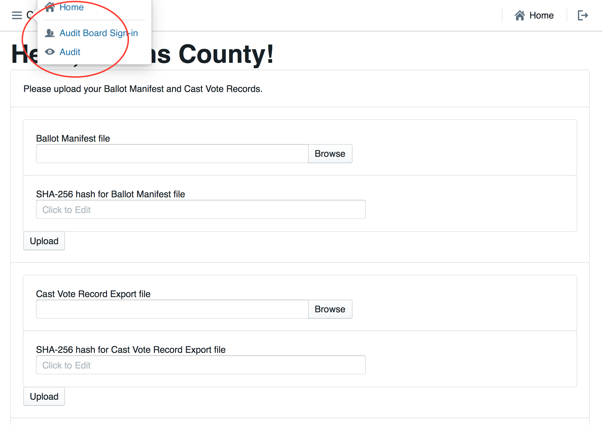

# Colorado Risk Limiting Audit 
# User Manual

This User Manual provides an overview of the components that comprise 
the Colorado Department of State’s (CDOS) Risk Limiting Audit Tool (RLA Tool). 
It contains annotated screenshots with detailed descriptions of what is 
contained on every page users will experience. It also contains a glossary 
of relevant terms. This RLA Tool represents the cutting edge in efforts to 
provide verifiable evidence that election results are accurate, and November 
2017 is the first time any state or jurisdiction has implemented them on a 
widescale basis.

## Basic Structure of Risk Limiting Audits

Once the Secretary of State establishes a risk limit and selects contests to 
be audited, counties will then use the RLA Tool to upload ballot manifests, 
cast vote records (CVRs), and summary results to a central server. The RLA 
Tool will use this data to determine the initial set of ballots to be checked 
for each contest based on the risk limit and the margins of victory in the 
contests to be audited. The RLA Tool will report this information to each 
county, where the Audit Board, consisting of representatives of different 
political parties, will retrieve the appropriate ballots and record their 
interpretations of voter intent in the RLA Tool. If there are too many 
mismatches between the Audit Board’s interpretations and the choices 
reported by the vote-tallying system, additional ballots may need to be 
randomly selected until either the risk limit is satisfied or a complete 
hand count is conducted. Complete audit results are exported from the RLA 
Tool for import to a Public Audit Center hosted on the official CDOS website.

## RLA Tool

The RLA Tool facilitates running a risk limiting audit across all counties 
in Colorado simultaneously. The RLA Tool has two dashboards. One dashboard 
serves CDOS, and the other serves the Counties. Both the CDOS and County 
dashboards require authentication to login. The RLA Tool also provides 
information to be used for a Public Audit Center, but does not contain it.

### Logging In

On this page authorized users from the Secretary of State's office, as well as 
persons from the County can enter their login credentials to access the RLA Tool’s 
Dashboards.

---

Once logged in, users from the Department of State will see the Department of 
State home page.

---

Logged in County users will see a home page tailored to that County.

---

### Navigation

Both the Secretary of State site and each County site has a navigation menu 
in the upper left corner.

---

---

### 25.2.2 (A), Entering the Risk Limit

On this page the Sectretary of State will enter the Risk Limit for comparison audits.

---

### 25.2.2 (F) or (G), Audit Uploads

On this page county officials can upload their hashed Ballot Manifest and CVR files.

---

### 25.2.2 (H), Entering the Random Seed

This page allows the Secretary of State Once to enter the random seed, which 
is a 20 digit number chosen during a public ceremony. Once entered, this will 
trigger the random selection of which ballots to audit, which will be listed 
on the following page, and will be published to the County and Public Dashboards.

---

### 25.2.2 (I) Selecting Contests

This page allows the Secretary of State to select which statewide contest, and 
which countywide contests to audit. This information will be published to the 
County Dashboard when the selections have been made.

---

#### 25.2.3 (A)(1) Comparison Audits

On this page authorized Audit Board members can sign into the system to conduct 
the audit.

---

The RLA Tool allows Audit Boards to report the markings on each individual ballot.

This page allows Audit Board members to enter their collective interpretation 
of choices marked on the ballot. Once they have entered their interpretations, 
Audit Board members click ‘Review.’’ to be taken to the Audit Board Interpretation 
Review Screen.

Click "Review"

---

This page allows Audit Board members to review their choices, and then 
‘Submit and Next Ballot’ when ready to proceed to the next ballot. This 
process continues until all of the ballots for the batch are entered.
 This submission is final. There is no way to revise a ballot interpretation 
 once it has been submitted from the Review Screen.

Note: do *not* use your browser's "back" arrow during the audit process.
If the review screen does not match the Audit Board's interpretation,
click the "Back" button.

