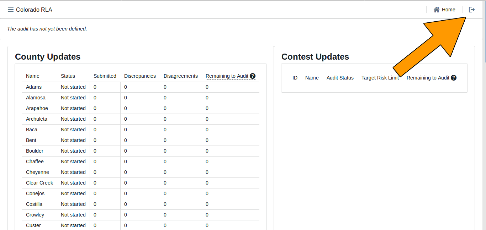
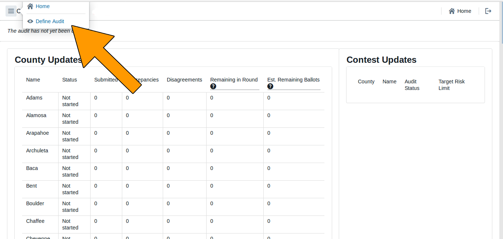
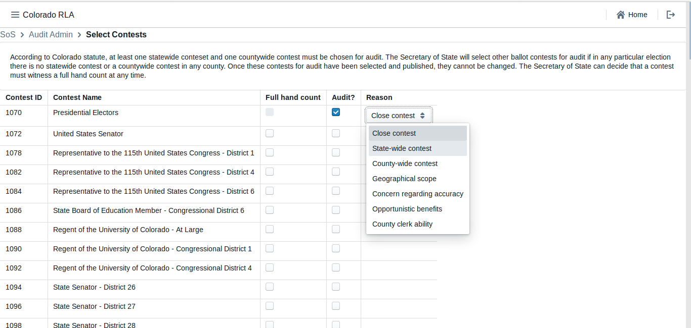
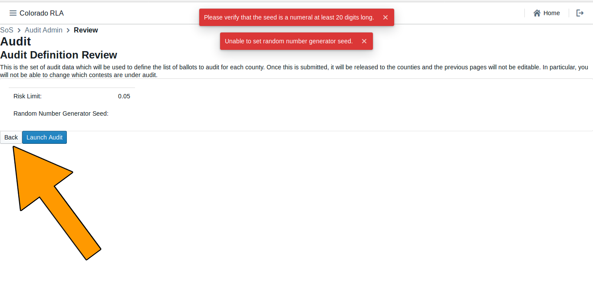
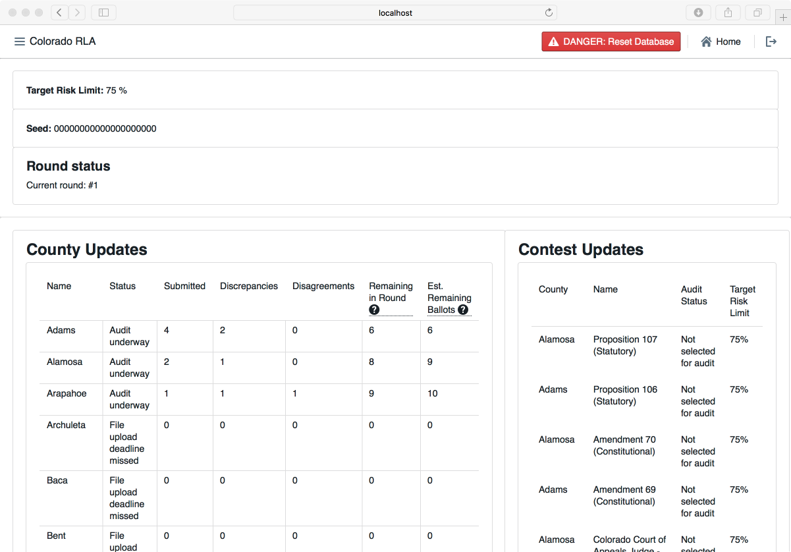

# Colorado Risk Limiting Audit 
# Secretary of State Run Book 

## Introduction

This Run Book guides State election administrators in Colorado who will be
implementing a Risk Limiting Audit (RLA) with a comparison audit.
The RLA Tool, developed by Free & Fair for the
Colorado Department of State for use in elections in November 2017 and later, 
supports running a Risk-Limiting Audit as required by
Colorado statute and as described in the
[Colorado Secretary of State's Rule 25](http://www.sos.state.co.us/pubs/rule_making/CurrentRules/8CCR1505-1/ElectionRules.pdf) for
elections. 

The RLA Tool helps the Colorado Secretary of State
fulfill the requirements of Rule 25.2.2 and Rule 25.2.3.
Using the RLA Tool, Secretary of
State can enter the risk limit, the publicly-generated random seed, and
the contests that drive the audit process. As Counties upload ballot 
manifests and CVR files, the RLA Tool allows the Secretary of State
to monitor progress. The Secretary of State can
use the tool to identify contests that should go to a full hand
count. The RLA Tool performs the calculations required by Rule 25, such as choosing random samples of ballots for audit and
determining actual risk levels. While audits are ongoing,
the Secretary of State can monitor the progress of the individual
County audit boards.

The RLA Tool also exports reports and files for use in the Audit Center, a
website required by Rule 25 to disseminate audit-related information
to the public.
 
### Logging In

Department of State users must log in to the RLA Tool.
**[SCREENSHOT NEEDS UPDATE]**

The RLA Tool will direct users to the Department of 
State home page. At the start of the audit process, this page will contain no information  Note the 
logout button , in the upper right of this (and every) page.

### Navigation

Note the navigation menu in the upper left corner.

### Audit Status

Text indicating the status of the audit is near the top of the page. 
**[SCREENSHOT NEEDS UPDATE]**

### 25.2.2 (A), Entering the Risk Limit

The Secretary of State will enter date the election will take place, the type
of election, and the Risk Limit. Note that once these selections are entered they cannot be modified. To continue, click ‘Save
and Next.’ 

The County Update table allows the Secretary of State to see which Counties have uploaded which files. 

**[SCREENSHOT NEEDS UPDATE] [missing]**

Note the change in the status message now that the Risk Limit has been entered.

The County Update table allows the Secretary of State to see which Counties have uploaded which files. When the Counties have uploaded the necessary files, the Secretary of State can proceed to define the audit — choose contests and set the risk limit — 
using the dropdown menu on the upper left.

**[SCREENSHOT NEEDS UPDATE] [show realistic County status] ** 

The County Update table allows the Secretary of State to see which Counties have uploaded which files. 

### 25.2.2 (I) Selecting Contests

The Secretary of State will then select the contests that will drive the
sample size and stop/go decisions for each round.  Rule
Rule 25 calls these "contests to be audited".

**[SCREENSHOT NEEDS UPDATE] [new set of dropdown choices, County names not Contest IDs] ** 

### 25.2.2 (H), Entering the Random Seed

The Secretary of State enters the random seed. Note that once the seed is entered, it cannot be changed. 

**[SCREENSHOT NEEDS UPDATE] [new text] ** 

If the random seed is not exactly 20 digits long, the system shows a red error message. User will have to click the "Back" button and try again.

**[SCREENSHOT NEEDS UPDATE] [orange arrow pointing to back button] ** 

Once the random seed is entered the the Secretary of State can launch the audit by clicking the "Launch Audit" button.

**[SCREENSHOT NEEDS UPDATE] [missing, show good Audit Def'n Review with orange arrow to "Launch Audit" button] ** 

### Audit Rounds

Once the audit is launched, the first round of the audit begins. In each round, the tool shows each County a list of ballot cards to be reviewed. As the County Audit Boards review ballot cards and enter interpretations, the Secretary of State can see the number of ballot cards reviewed so far, the number of ballot cards with discrepancies, 
<!— the number of disagreements —>
and the number of ballot cards yet to be reviewed in the current round in the County Update table. 

<!— and what of the "Contest Update" table? —>

### 25.2.3 (C) Comparisons, Termination, Additional Ballots

The RLA Tool permits the Secretary of State to 
see the progress of audit for selected contests and the estimated 
number of ballot cards remaining to be audited to meet the risk limit.
**[SCREENSHOT NEEDS UPDATE] [show more counties]**

The RLA Tool also allows the Secretary of State to designate a contest
for hand counting at any time.

The RLA Tool automatically randomly selects additional ballots for
audit as necessary until the risk limit is met.

### 25.2.3 (A)(2) Ballot Polling Audits

The conduct and reporting of the Audit Board for a Ballot Polling
Audit must be completed outside the RLA Tool.

### Exports
<!--- need to write this section --->
