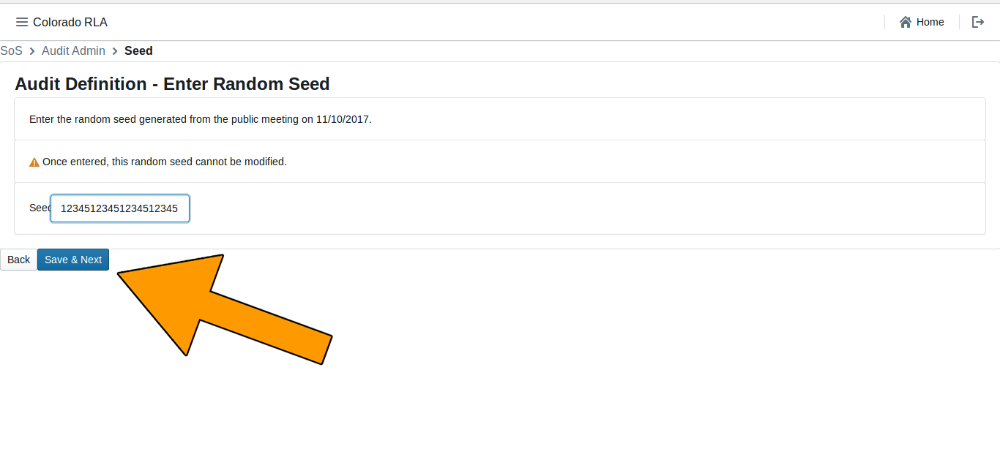
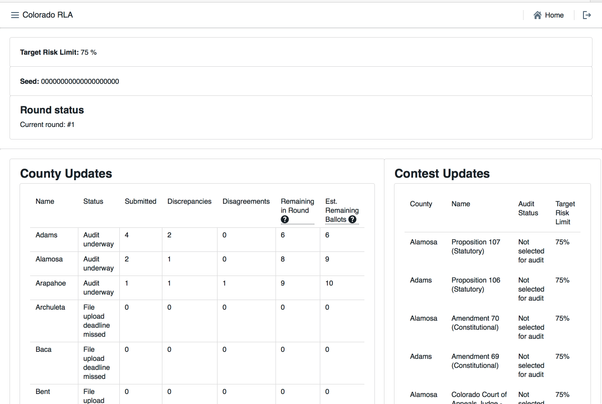
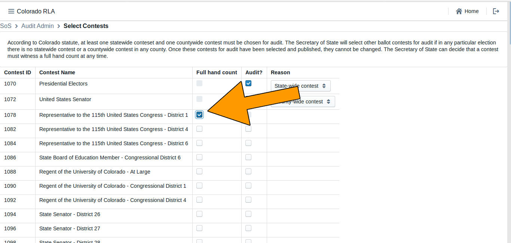

# Colorado Risk Limiting Audit 
# Secretary of State Run Book 

## Introduction

This Run Book guides County election administrators in Colorado who will be
implementing a Risk Limiting Audit (RLA) with a comparison audit.
The RLA Tool, developed by Free & Fair for the
Colorado Department of State for use in elections in November 2017 and later, 
supports running a Risk-Limiting Audit as required by
Colorado statute and as described in the
[Colorado Secretary of State's Rule 25](http://www.sos.state.co.us/pubs/rule_making/CurrentRules/8CCR1505-1/ElectionRules.pdf) for
elections. 

The RLA Tool helps the Colorado Secretary of State
fulfill the requirements of Rule 25.2.2 and Rule 25.2.3.
Using the RLA Tool, Secretary of
State can enter the risk limit, the publicly-generated random seed, and
the contests that drive the audit process. As Counties upload ballot 
manifests and CVR files, the RLA Tool allows the Secretary of State
to monitor progress. The Secretary of State can
use the tool to identify contests that should go to a full hand
count. The RLA Tool performs the calculations required by Rule 25, such as choosing random samples of ballots for audit and
determining actual risk levels. While audits are ongoing,
the Secretary of State can monitor the progress of the individual
County audit boards.

The RLA Tool also creates export files for use in the Audit Center, a
website required by Rule 25 to disseminate audit-related information
to the public.
 
### Logging In

Persons from the Secretary of State's office must log in to the RLA Tool.

The RLA Tool will direct users to the (initially empty) Department of 
State home page. Note the logout button, circled in the upper right 
of this (and every) page.

### Navigation

Note the navigation menu in the upper left corner.

### 25.2.2 (A), Entering the Risk Limit

The Secretary of State will enter date the election will take place, the type
of election, and the Risk Limit. Once their selections are entered click ‘Save
and Next.’

Once this is done you will see a message saying ‘Waiting for counties to upload contest
data.’

Once the Counties have successfully uploaded their ballot manifests and CVR
files use the dropdown menu to define the audit.

### 25.2.2 (B) - (E)

These parts of Rule 25 must be completed outside of the RLA Tool.

The upload of RLA Tabulation Results Export to the State's Election
Night Reporting System required by 25.2.2 (F)(3) must be completed
outside of the RLA Tool.

### 25.2.2 (I) Selecting Contests

The Secretary of State will then select the contests that will drive the
sample size and stop/go decisions for each round.  Note that while
Rule 25 calls these "contests to be audited", the RLA Tool effectively
audits all contests, while using the contests selected by the
Secretary of State to calculate the risk levels.

### 25.2.2 (H), Entering the Random Seed

The Secretary of State will enter the random seed.

You will receive the following error if the random seed is not long enough.

The RLA Tool uses the random seed in the required pseudo-random number
generator. Once the random seed is entered the audit has begun.

### 25.2.2 (K) Random Selection of Ballot Cards for Audit

Based on the pseudo-random number generator and random seed from
25.2.2 (H) and the current risk levels, the RLA Tool determines the
selection of ballot cards for audit. This information is reported to the 
County dashboard. The RLA Tool also exports all of this information (general election
information, random seed, contests selected to guide the audit, etc.)
in a standard format, which the Secretary of State can post to the
Audit Center hosted on the Secretary of State website.

### 25.2.3 (A) Ballot Retrieval, Chain of Custody and Examination

Ballot retrieval from storage container and verification of seals
relative to the chain-of-custody logs must be done outside the RLA
Tool.

### 25.2.3 (C) Comparisons, Termination, Additional Ballots

The RLA Tool performs the comparison of the Audit Board's
interpretations with the corresponding cast vote record from the
voting computer system. RLA Tool permits the Secretary of State to 
see the progress of audit for selected contests and the estimated 
number of ballot cards remaining to be audited to meet the risk limit.
NEED BETTER SCREENSHOT THAT SHOWS MORE COUNTIES

The RLA Tool also allows the Secretary of State to designate a contest
for hand counting at any time.

The RLA Tool automatically randomly selects additional ballots for
audit as necessary until the risk limit is met.

### 25.2.3 (A)(2) Ballot Polling Audits

The conduct and reporting of the Audit Board for a Ballot Polling
Audit must be completed outside the RLA Tool.

### Exports
<!--- need to write this section --->
