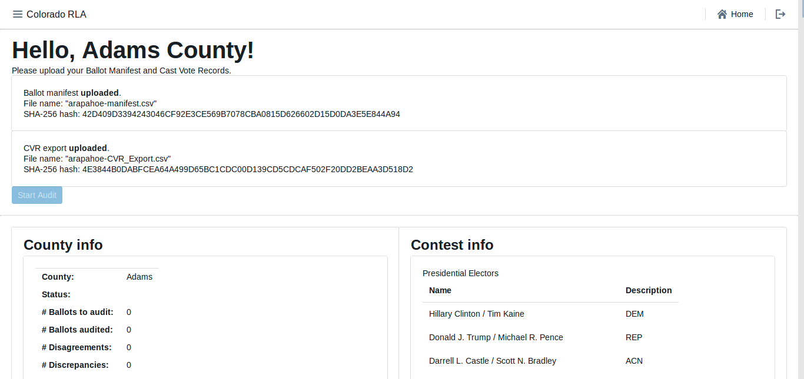
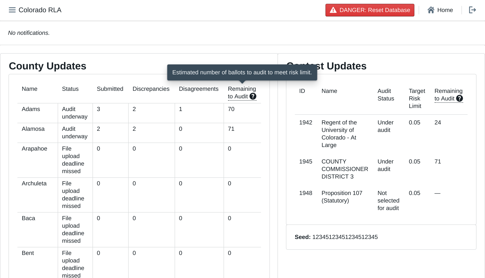

# Colorado Risk Limiting Audit 
# Run Book 

## Introduction

This Run Book is written for election administrators who will be
implementing a Risk Limiting Audit (RLA) using the RLA Tool.  The Run
Book will assist these election administrators in using to tool to
carry out the actions required for a RLA.

The Risk-Limiting Audit (RLA) Tool, developed by Free & Fair for the
Colorado Department of State for use in elections from November 2017
forward, supports running a Risk-Limiting Audit as required by
Colorado statute and as described in
the
[Colorado Secretary of State's Rule 25](http://www.sos.state.co.us/pubs/rule_making/CurrentRules/8CCR1505-1/ElectionRules.pdf) for
elections. The RLA Tool supports a variety of requirements of Rule
25.2.2 and Rule 25.2.3, as described in detail below.

The RLA Tool enables the Secretary of State and each individual County
to carry out a Risk-Limiting Audit. Using the RLA Tool, Secretary of
State enter the risk limit, the publicly-generated random seed, and
the contests that drive the audit process. The Secretary of State can
also identify, at any time, contests that should go to a full hand
count. Counties upload verified ballot manifests and cast vote record
(CVR) files. The RLA Tool performs the necessary calculations to run
the RLA, such as choosing random samples of ballots for audit and
determining actual risk levels. County Audit Boards then enter
interpretations of ballots into the Tool. While audits are ongoing,
the Secretary of State can monitor the progress of the individual
Counties.

The RLA Tool also creates export files for use in the Audit Center, a
website required by Rule 25 to disseminate audit-related information
to the public.
 
### Logging In

Persons from the Secretary of State's office as well as persons from
the County first must log in to the RLA Tool.

The RLA Tool will direct each user to the appropriate home page. A
user from the Department of State will see the (initially empty)
Department of State home page. Note the logout button, circled in the
upper right of this (and every) page.

A County user will see a home page tailored to that County.

### Navigation

Both the Secretary of State site and each County site has a navigation
menu in the upper left corner.

### 25.2.2 (A), Entering the Risk Limit

The Secretary of State will enter the Risk Limit for comparison
audits. *(Ed. note: Note that risk limits are currently entered as a
floating point number. E.g., 0.1 means 10%. In the phase-3 release
they will be entered as a proper percentage. E.g., 5.5%)*

### 25.2.2 (B) - (E)

These parts of Rule 25 must be completed outside of the RLA Tool.

### 25.2.2 (F) or (G), <a name="comparison-audit-upload">Audit Uploads</a>

To prepare for upload, the ballot manifest and the CVR file must be
first verified and hashed using any SHA-256 hash utility. The RLA Tool
itself does not provide a utility for verification or hashing.

Once the ballot manifest and CVR files are verified and hashed, they
can be uploaded into the RLA Tool. If the upload process is
interrupted the process will have to be repeated. It is not possible
to resume interrupted uploads.

After successfully uploading both the Ballot Manifest and the CVR
files, the County Dashboard shows the current audit status, including
all contests on all CVRs, the estimated number of ballot cards
remaining to be audited to meet the risk limit, the number of 
discrepancies and disagreements witnessed during the audit, etc.

The upload of RLA Tabulation Results Export to the State's Election
Night Reporting System required by 25.2.2 (F)(3) must be completed
outside of the RLA Tool.

### 25.2.2 (H), Entering the Random Seed

The Secretary of State will enter the random seed.

The RLA Tool uses the random seed in the required pseudo-random number
generator.

### 25.2.2 (I) Selecting Contests

The Secretary of State will select the contests that will drive the
sample size and stop/go decisions for each round.  Note that while
Rule 25 calls these "contests to be audited", the RLA Tool effectively
audits all contests, while using the contests selected by the
Secretary of State to calculate the risk levels. *(Ed. note: The
notion of "rounds" is still under discussion and not included in the
stage-2 deliverable.)*

### 25.2.2 (J) Number of Ballot Cards to Audit

The number of ballot cards to audit changes during the course of the
audit depending on the risk level, which in turn depends on the number
of overstatements (i.e., ballots whose correction by the Audit Board
decreases a margin of victory in one of the selected contests) so
far. If the Audit Board's interpretations match that of the tabulation
software that created the CVRs, then the audit can sometimes complete
early. If there are discrepancies or disagreements, then the number of
ballot cards to audit can grow.

<!--  -->

### 25.2.2 (K) Random Selection of Ballot Cards for Audit

Based on the pseudo-random number generator and random seed from
25.2.2 (H) and the current risk levels, the RLA Tool determines the
selection of ballot cards for audit.

<!--  -->

The RLA Tool exports all of this information (general election
information, random seed, contests selected to guide the audit, etc.)
in a standard format, which the Secretary of State can post to the
Audit Center hosted on the Secretary of State website. *(Ed. note:
This feature is not included in the stage-2 deliverable.)*

### 25.2.3 (A) Ballot Retrieval, Chain of Custody and Examination

Ballot retrieval from storage container and verification of seals
relative to the chain-of-custody logs must be done outside the RLA
Tool.

#### 25.2.3 (A)(1) Comparison Audits

The Audit Board does not log directly into the RLA Tool with usernames
and passwords. However, whenever the Audit Board begins to interact
with the RLA Tool, either at the beginning of an audit round or after
taking a break, there is an informal sign-in process. After the
authenticated County Audit Administrator formally logs in, there is a
screen where the identity and party affiliation of Audit Board Members
can be entered or changed.

The RLA Tool allows Audit Boards to report the markings on each
individual ballot.

Before recording voter intent, please double-check that the paper
ballot ID and Ballot Style match the ID and ballot style listed on the
screen.  Then record on the screen all final voter intent marked on
the paper ballot.  In case of an overvote, mark each of the (too many
or too few) choices the voter intended; the RLA tool will recognize
overvotes and undervotes. In case the Audit Board cannot reach
consensus, mark the "No Consensus" box on the screen.  Audit Board
members can make notes in the comment field.
<!-- Review CDOS -->

After entering the interpretation of the markings from any one ballot,
the Audit Board can review what was entered.

Check that the information on the review screen reflects the Audit
Board's interpretation of the ballot. Note that in case of an
overvote, the review screen will say, simply, "overvote".

If the review screen matches the Audit Board's interpretation, click
"Submit and Next Ballot". This submission is final. There is no way to
revise a ballot interpretation once it has been submitted from the
Review Screen.

Note: do *not* use your browser's "back" arrow during the audit
process.  If the review screen does not match the Audit Board's
interpretation, click the "Back" button. *(Ed. note: We intend to
ensure that pressing the brower's back button is not harmful in 
the phase-3 deliverable.)*

### 25.2.3 (A)(2) Ballot Polling Audits

The conduct and reporting of the Audit Board for a Ballot Polling
Audit must be completed outside the RLA Tool.

### 25.2.3 (B) Non-Unanimous Audit Board

An Audit Board can use the RLA Tool to report lack of consensus on any
particular contest on any particular ballot.

### 25.2.3 (C) Comparisons, Termination, Additional Ballots

The RLA Tool performs the comparison of the Audit Board's
interpretations with the corresponding cast vote record from the
voting computer system. RLA Tool permits the Secretary of State and
County Administrators to see the progress of audit for selected
contests and the estimated number of ballot cards remaining to be
audited to meet the risk limit.

The RLA Tool also allows the Secretary of State to designate a contest
for hand counting at any time. *(Ed. note: Handling this asynchronous
notification is not supported in the stage-2 deliverable.)*

The RLA Tool automatically randomly selects additional ballots for
audit as necessary.

### Audit Board Intermediate Audit Report Page

If the Audit Board needs to take a break, go to lunch, head home for
the night, or change, then the Audit Board must file an "Intermediate
Audit Report" on their auditing. *(Ed. note: A button for filing such
a report will be available on the **Audit Board Interpretation Page**
in the phase-3 release.)*

### Audit Board Final Audit Report Page

After the RLA Tool deems that a County's audit is complete, the Audit
Board must file an "Final Audit Report" on their audit. *(Ed. note: A
button for filing such a report will be available on the **Audit Board
Interpretation Page** in the phase-3 release.)*
