# The Colorado Risk Limiting Audit (CORLA) Tool User Manual
## Free & Fair, September 2017

This User Manual provides an overview of the components that comprise
the Colorado Department of State’s (CDOS) Risk Limiting Audit Tool
(RLA Tool). It contains screenshots of every page users experience. It
also contains a glossary of relevant terms. This RLA Tool represents
the cutting edge in efforts to provide verifiable evidence that
election results are accurate, and November 2017 is the first time any
state or jurisdiction has implemented them on a wide scale basis.

## Basic Structure of Risk Limiting Audits

Once the Secretary of State uses the RLA Tool to establish a risk
limit and selects contests to guide the audit, counties use the RLA
Tool to upload verified ballot manifests and cast vote records (CVRs)
files that they have exported from their Election Management
Systems. The RLA Tool uses this data to determine the random ballot
cards to audit, using the risk limit and the margins of victory in the
selected contests as a guide for what constitutes a quality audit. 

The RLA Tool reports this information to each county via County
Dashboard. Within the County, an Audit Board, consisting of
representatives of different political parties, working with county
administrators, physically retrieves the randomly chosen ballot cards
and record their interpretations of voter intent in the RLA Tool.
Randomly selected ballots are presented to County Audit Boards until
either the risk limit is satisfied or the Secretary of State indicates
that a full hand count is required.

Complete audit results and artifacts allowing the public to check,
independently, that the audit was carried out correctly are exported
from the RLA Tool for import to a Public Audit Center hosted on the
official CDOS website.

## Dashboards

The RLA Tool facilitates running a risk limiting audit across all
counties in Colorado simultaneously. The RLA Tool has a dashboard for
the Department of State election administrators who work for the
Secretary of State. Each of the 64 Counties has a customized County
Dashboard. All of these dashboards require authentication to login.

\newpage
### Logging In

On this page authorized users from the Secretary of State's office, as
well as county administrators from each County, can enter their login
credentials to access the RLA Tool’s Dashboards.

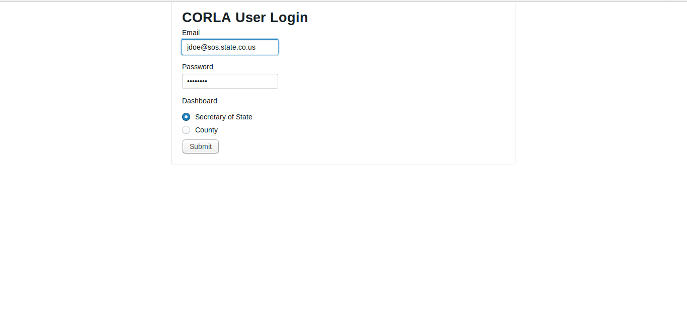

---

Once logged in, users from the Department of State see the (initially
empty) Department of State home page. Note the logout button, indicated
in the upper right of this (and every) page.

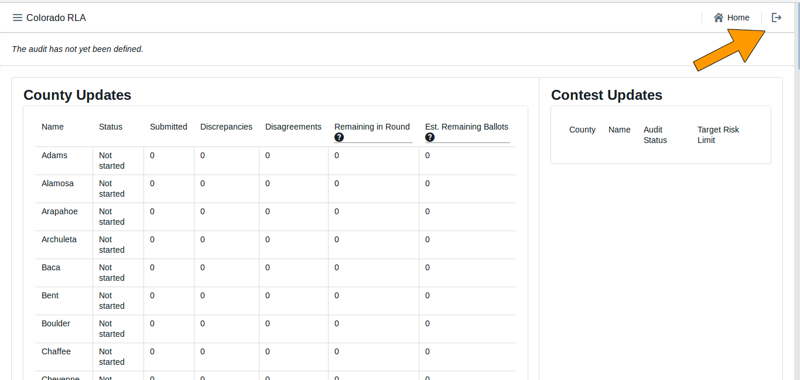

---

Logged in County users see a home page tailored to that County.

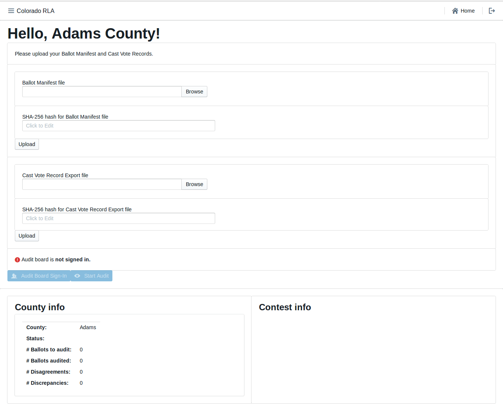

\newpage
### Navigation

Both the Secretary of State Dashboard and each County Dashboard has a
navigation menu in the upper left corner.

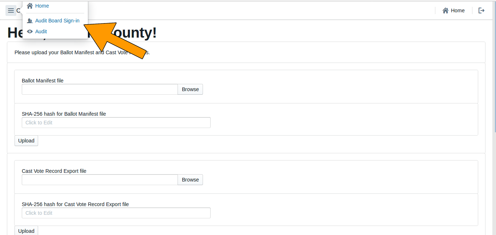

---

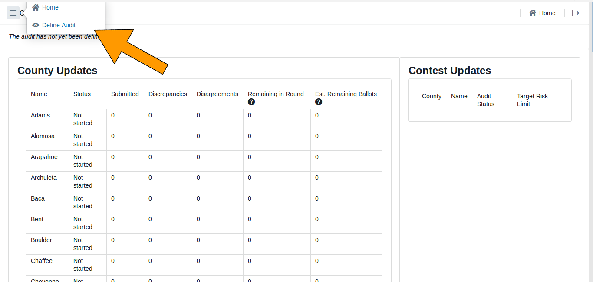

\newpage
### Entering the Risk Limit

On this page the Secretary of State enters the Risk Limit for
comparison audits.

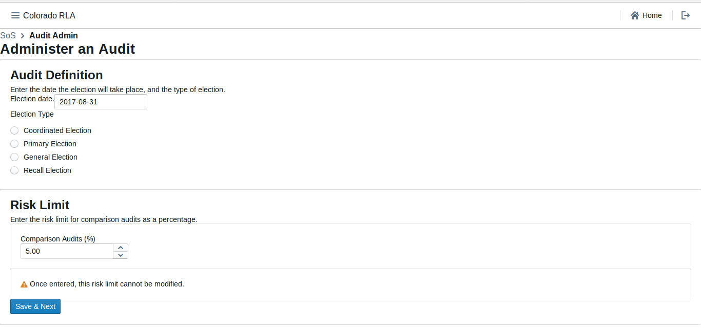

\newpage
### County Home Page

On this page county officials upload their hashed verified Ballot
Manifest and CVR files.

\newpage
### Entering the Random Seed

This page allows the Secretary of State to enter the random seed,
which is a 20 digit number chosen during a public ceremony. Doing so
triggers the publication of the seed and the random selection of which
ballots to audit (statewide).  All of that information is listed on
the following page, and are published to the County and Public
Dashboards.

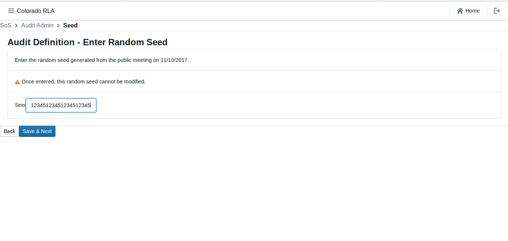

\newpage
### Audit Definition Review

This page allows the Secretary of State to review the audit data which will
be used to define the list of ballots to audit for each county.

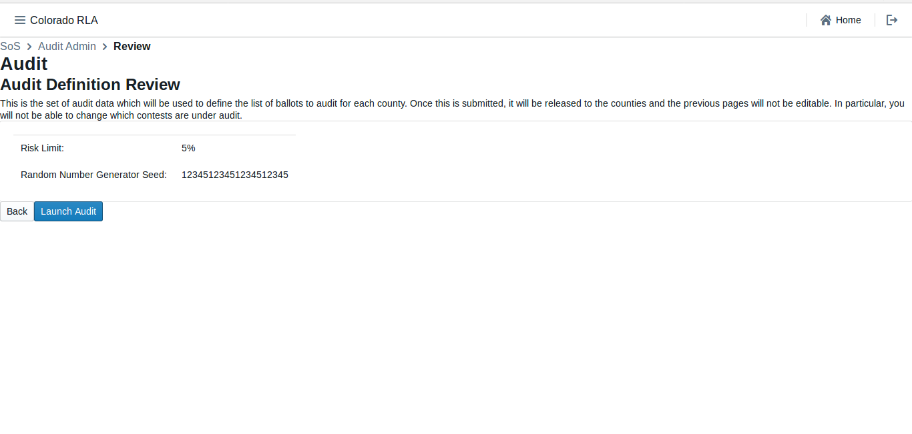

\newpage
### Audit Ongoing Page

This page provides an overview of the audit in progress, updated in
real time.  It shows County level and Contest level details, and
indicates when: 1) the audit is complete, 2) another round of ballots
must be counted, and 3) if a Full Hand Count is required.

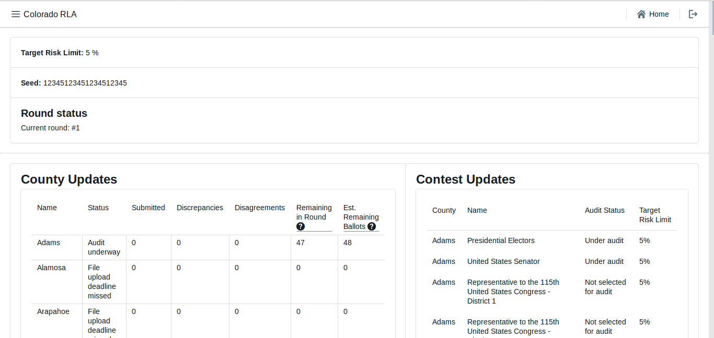

\newpage
### Ballots to Audit Page

This page shows information on the randomly selected ballots for audit.

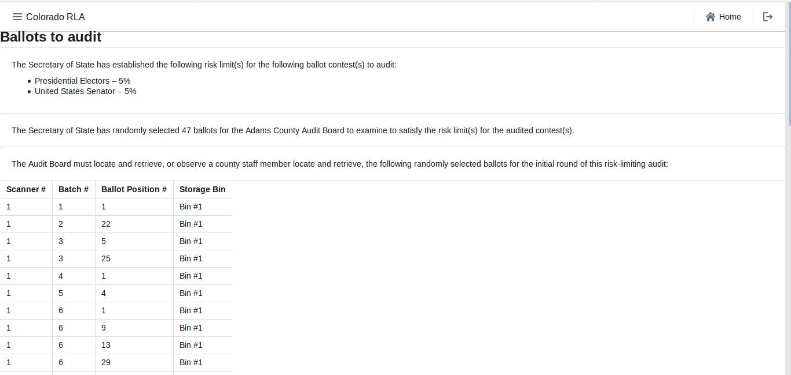

### Selecting Contests

This page allows the Secretary of State to select which statewide
contest, and which countywide contests, to audit in this
election. Once these selections are finalized, they are published to
the audit record and cannot be changed. On this same page the
Secretary of State may select contests for full hand counts at any
time.

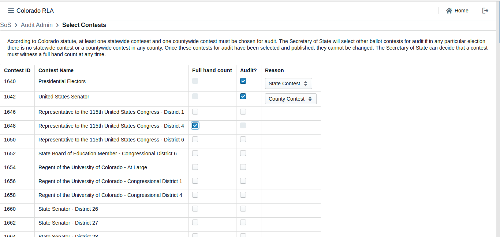

---

### Audit Board Sign In

Audit Board members use this page to sign into the system to conduct
the audit.

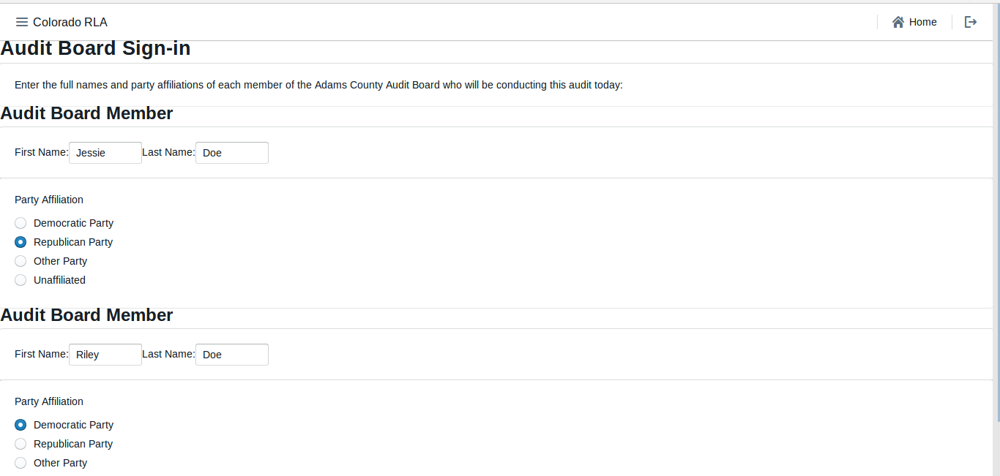

---

### Audit Board Interpretation Page

The RLA Tool allows Audit Boards to report the markings on each
individual ballot card.

This page allows Audit Board members to enter their collective
interpretation of choices marked on the ballot. Once they have entered
their interpretations, Audit Board members click the "Review" button
to be taken to the Audit Board Interpretation Review Screen.

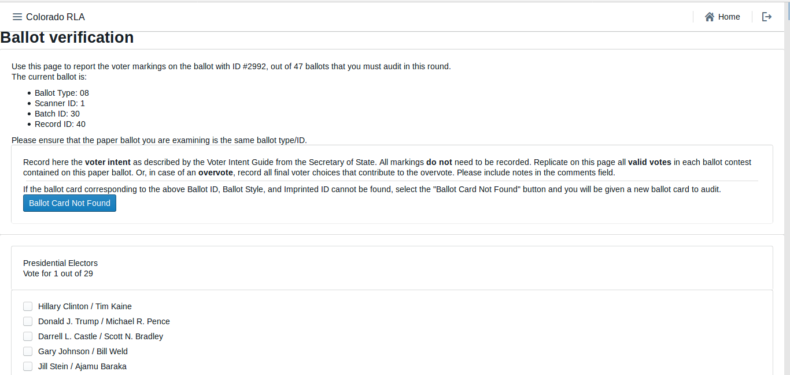

### Audit Board Interpretation Review Page

This page allows Audit Board members to review their choices, and then
press "Submit and Next Ballot" when ready to proceed to the next
ballot. This submission is final. There is no way to revise a ballot
interpretation once it has been submitted from the Review Screen.

This process continues until sufficient ballot cards have been
audited such that the RLA Tool decides that the audit is complete.

Note: do *not* use your browser's "back" arrow during the audit
process.  If the review screen does not match the Audit Board's
interpretation, click the "Back" button on the user
interface.

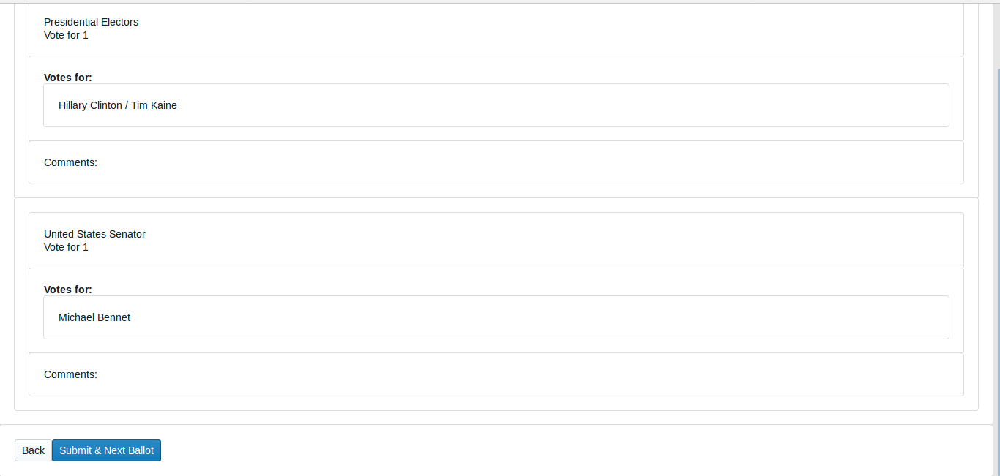

### Audit Board Intermediate Audit Report Page

If the Audit Board needs to take a break, go to lunch, head home for
the night, or change, then the Audit Board must file an "Intermediate
Audit Report" on their auditing.

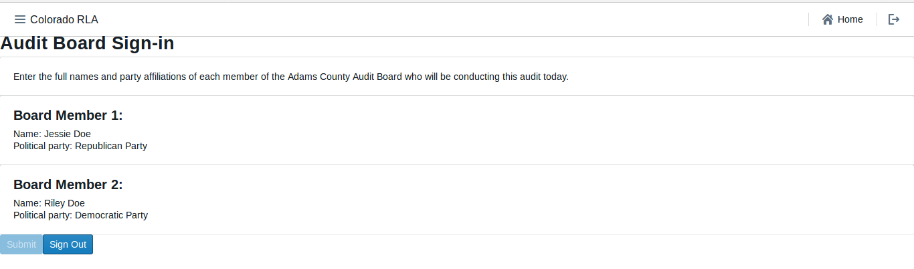

### Audit Board Final Audit Report Page

After the RLA Tool deems that a County's audit is complete, the Audit
Board must file an "Final Audit Report" on their audit.
