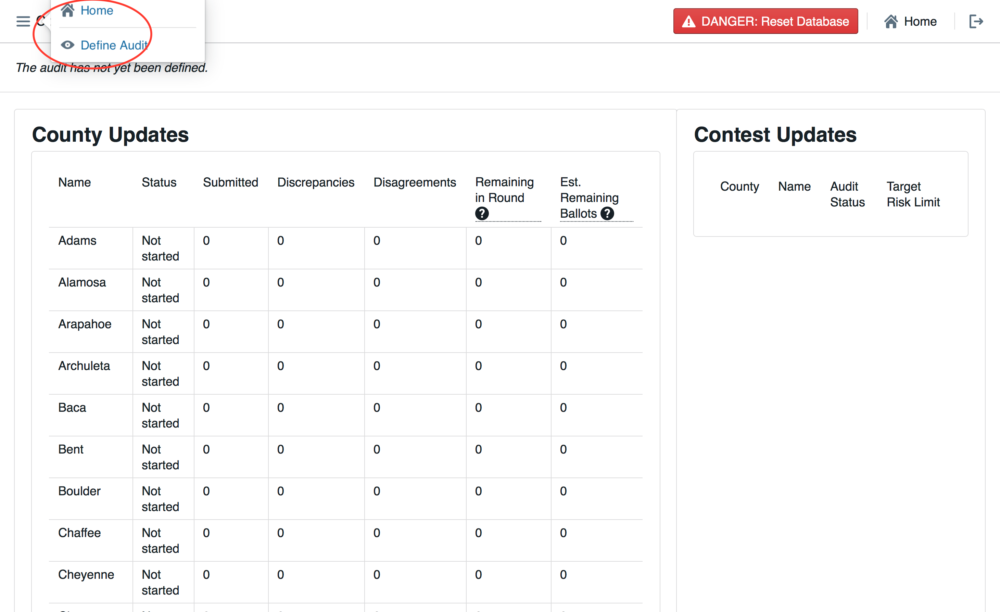

# Colorado Risk Limiting Audit 
# User Manual

This User Manual provides an overview of the components that comprise
the Colorado Department of State’s (CDOS) Risk Limiting Audit Tool
(RLA Tool).  It contains annotated screenshots with detailed
descriptions of what is contained on every page users will
experience. It also contains a glossary of relevant terms. This RLA
Tool represents the cutting edge in efforts to provide verifiable
evidence that election results are accurate, and November 2017 is the
first time any state or jurisdiction has implemented them on a wide
scale basis.

## Basic Structure of Risk Limiting Audits

Once the Secretary of State uses the RLA Tool to establish a risk
limit and selects contests to guide the audit, counties will then use
the RLA Tool to upload ballot manifests, cast vote records (CVRs), and
summary results to a central server. The RLA Tool will use this data
to determine the ballot cards to be checked for each contest based on
the risk limit and the margins of victory in the selected
contests. The RLA Tool will report this information to each county,
where the Audit Board, consisting of representatives of different
political parties, will physically retrieve the appropriate ballots
and record their interpretations of voter intent in the RLA Tool.
Randomly selected ballots will be presented to County Audit Boards
until either the risk limit is satisfied or the Secretary of State
indicates that a full hand count is required.  Complete audit results
and artifacts allowing the public to check, independently, that the
audit was carried out correctly are exported from the RLA Tool for
import to a Public Audit Center hosted on the official CDOS
website. *(Ed note: Report export is not included in the stage-1
deliverable, as we need clarity on the exact contents of said
report.)*

## Dashboards

The RLA Tool facilitates running a risk limiting audit across all
counties in Colorado simultaneously. The RLA Tool has a dashboard for
the statewide election adminstrators who work for the Secretary of
State. Each of the 64 Counties has a customized dashboard. All of
these dashboards require authentication to login.

### Logging In

On this page authorized users from the Secretary of State's office, as
well as persons from the County, can enter their login credentials to
access the RLA Tool’s Dashboards. *(Ed. note: Two-factor
authentication to CDOS's authentication servers will be included in a
later release.)*

---

Once logged in, users from the Department of State will see the
(initially empty) Department of State home page.

---

Logged in County users will see a home page tailored to that County.

---

### Navigation

Both the Secretary of State site and each County site has a navigation menu 
in the upper left corner.

---

---

### Entering the Risk Limit

On this page the Sectretary of State will enter the Risk Limit for
comparison audits.

---

### County Home Page

On this page county officials can upload their hashed Ballot Manifest and CVR files.

---

### Entering the Random Seed

This page allows the Secretary of State Once to enter the random seed,
which is a 20 digit number chosen during a public ceremony. Once
entered, this will trigger the random selection of which ballots to
audit, which will be listed on the following page, and will be
published to the County and Public Dashboards.

---

### Audit Ongoing Page

This page provides an overview of the audit in progress, updated in
real time.  It shows County level and Contest level details, and will
indicate when: 1) the audit is complete, 2) another round of ballots
must be counted, and 3) if a Full Hand Count is required. *(Ed. note:
The notion of rounds is still under discussion and not included in the
stage-2 release.)*

### Selecting Contests

This page allows the Secretary of State to select which statewide
contest, and which countywide contests to audit. This information will
be published to the County Dashboard when the selections have been
made. On this same page the Secretary of State may select contests for
full hand counts.

---

### Audit Board Sign In

On this page authorized Audit Board members can sign into the system
to conduct the audit.

---

### Audit Board Interpretation Page

The RLA Tool allows Audit Boards to report the markings on each
individual ballot.

This page allows Audit Board members to enter their collective
interpretation of choices marked on the ballot. Once they have entered
their interpretations, Audit Board members click the "Review" button
to be taken to the Audit Board Interpretation Review Screen.

Click "Review"

---

### Audit Board Interpretation Review Page

This page allows Audit Board members to review their choices, and then
press "Submit and Next Ballot" when ready to proceed to the next
ballot. This process continues until all of the ballots are
entered. This submission is final. There is no way to revise a ballot
interpretation once it has been submitted from the Review Screen.

Note: do *not* use your browser's "back" arrow during the audit
process.  If the review screen does not match the Audit Board's
interpretation, click the "Back" button on the user
interface. *(Ed. note: We intend to ensure that pressing the brower's
back button is not harmful in a later delivery.)*

